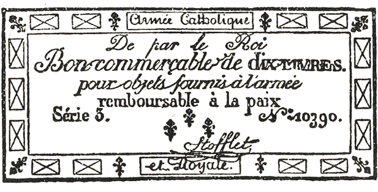

## (1)  
Jak je možno vniknout do kláštera

A do toho domu Jean Valjean jako by „spadl z nebe“, řekl Fauchelevent.

Přelezl zahradní zeď, která tvořila kout v ulici Polonceau. Andělský chorál, který zaslechl uprostřed noci, bylo matutinum, jitřní zpěv jeptišek; síň, kterou zahlédl ve tmě, byla kaple; přízrak, který viděl ležet na dlažbě, byla sestra konající pokání; rolnička, která ho svým zvoněním tak podivně vzrušila, byl zvonek, připevněný ke kolenu zahradníka Faucheleventa.

Když uložili Cosettu ke spánku, pojedli Jean Valjean a Fauchelevent kousek sýra, popili skleničku vína a hřáli se u příjemného ohně, přikládajíce z otýpky klestí; a nakonec, protože na jediném lůžku v celém domku spala Cosetta, vrhli se oba jeden jako druhý na otep slámy. Než zavřel oči, Jean Valjean řekl:

„Teď tu musím zůstat.“

Ta slova vrtala Faucheleventovi mozkem celou noc.

Máme-li říci pravdu, ani jeden z nich oka nezamhouřil.

Jean Valjean věděl, že je odhalen a že ho Javert stopuje, a proto správně soudil, že by byl s Cosettou ztracen, kdyby se vrátil do Paříže. Protože ho nový náraz větru právě zavál do kláštera, Jean Valjean myslil jen na to, jak by tam zůstal. Pro nešťastníka v jeho postavení byl klášter místem nejnebezpečnějším a zároveň nejbezpečnějším; nejnebezpečnějším proto, že tam žádný muž nesměl vkročit. Kdyby ho zde přistihli, bylo by to dopadení při činu a Jean Valjean by šel z kláštera rovnou do vězení; klášter byl však zároveň místem nejjistějším, neboť kdo by ho tu hledal, kdyby ho jeptišky přijaly do služeb a mohl zde bydlit? Bydlit na nemožném místě byla jediná možnost, jak se zachránit.

Fauchelevent si také lámal hlavu. Nejprve si uvědomil, že ničemu nerozumí. Jak se tu pan Madeleine octl, když jsou zdi tak vysoké? Zdi klášterů se jen tak lehce nepřekračují. Jak se sem dostal s dítětem? Tak příkrou zeď není přece možné zlézt s dítětem v náručí. Co je to za dítě? Odkud přicházejí ti dva? Od dob, co byl v klášteře, Fauchelevent neslyšel o Montreuil-sur-Mer a nevěděl tudíž, co všechno se událo. Vzezření pana Madeleina nevybízelo právě k důvěrnostem; a potom si Fauchelevent říkal: „Světců se přece nevyptáváme!“ V jeho očích si pan Madeleine uchoval všechnu úctu. Z několika slov, která uklouzla Jeanu Valjeanovi, zahradník pouze usoudil, že pan Madeleine v těžkých dobách snad přišel na mizinu a je pronásledován věřiteli; nebo že ublížil svému dobrému jménu tím, že se zapletl do nějaké politické aféry a skrývá se; a to nebylo proti srsti Faucheleventovi, který – jak tak mnoho našich venkovanů ze severu Francie – byl v jádře starým bonapartistou. Aby se ukryl, vybral si pan Madeleine za svůj útulek klášter a bylo docela přirozené, že zde chce zůstat. Ale přesto mu nešlo do hlavy – a Fauchelevent se k tomu stále vracel –, jak se sem pan Madeleine dostal a jak to, že má s sebou holčičku. Fauchelevent je přece viděl, ohmatal, mluvil s nimi, a pořád tomu nevěřil. Nepochopitelná záhada vstoupila do domečku starého Faucheleventa. Fauchelevent tápal v domněnkách a věděl jasně jen jedno jediné – že mu pan Madeleine zachránil život. Tento fakt samotný mu stačil a rozhodl. Říkal si: „Teď došlo na mě.“ A v duchu dodával: „Pan Madeleine se tak dlouho nerozmýšlel, když se vecpal pod můj vůz, aby mě zpod něho dostal.“ A Fauchelevent se rozhodl, že pana Madeleina zachrání.

Ale přesto se sám sebe v duchu tázal a odpovídal si: „Zachránil bych ho po tom všem, co pro mne udělal, i kdyby byl zloděj? I pak bych ho zachránil. A kdyby byl vrah – zachránil bych ho? I tehdy bych ho zachránil. Zachráním ho, že je to světec? Určitě.“

Nechat ho však v klášteře, v tom byla svízel! Ale Fauchelevent necouvl ani před tímto fantastickým pokusem; tento ubohý pikardský venkovan, vedený jen svou oddaností, dobrou vůlí a trochou toho odvěkého selského chytráctví, sloužícího tentokrát šlechetnému předsevzetí, pokusil se ztéci nedobytnou klášterní pevnost a zdolat příkrý sráz řehole svatého Benedikta. Otec Fauchelevent byl stařec, který skoro celý život myslel jen na sebe, a teprve na konci života jako kulhavý neduživý člověk a už bez jakéhokoliv zájmu přišel na to, jak je sladké, můžeme-li někomu dokázat svou vděčnost; a když viděl, že se mu naskýtá příležitost k dobrému skutku, vrhl se na ni jako umírající, který vidí ve své blízkosti sklenici dobrého vína, jakého v životě neokusil, a jedním rázem je chtivě vypíjí. Můžeme dodat, že vzduch, který už léta dýchal v klášteře, potlačil v něm jeho dřívější povahu a nakonec v něm probudil touhu po dobrém skutku.

Rozhodl se tedy: oddá se panu Madeleinovi.

Před chvílí jsme o něm mluvili jako o _ubohém pikardském sedlákovi_. To označení je přesné, ale není úplné. Protože jsme dospěli ve svém vypravování až sem, bude prospěšné, řekneme-li něco o povaze otce Faucheleventa. Byl to sedlák, ale také písař, a proto jeho vrozená chytrost načichla pletichářstvím a do jeho prostomyslnosti se přímísil ostrovtip. Když z různých příčin ztroskotal ve svém zaměstnání, z místa písaře to dopracoval až na vozku a nádeníka. Ale přes všechno klení a švihání bičem, kterým povzbuzoval koně, zůstalo v něm přece trochu písaře. Neřekl nikdy „bysme“; mluvil správně, což je na venkově velmi vzácné, a ostatní venkované o něm říkali: mluví skoro jako pán v klobouku. Fauchelevent opravdu patřil k lidem, o nichž prostořeký a lehkomyslný slovník minulého století říkal, že jsou to _napůl páni, napůl kmáni_, a které zámecké metafory, ukapávající z panských sídel na venkovské chaloupky, označovaly jako polovenkovany, poloměšťáky; _ani ryby, ani raci_. Ačkoliv dobrák Fauehelevent v životě mnoho zkusil a ačkoliv ho osud hodně zkrušil, dal se, jakožto člověk zcela přímý pokaždé strhnout prvním hnutím; je to vzácná vlastnost, která brání, aby člověk nepodléhal zlu. Jeho chyby a vady – pochopitelně že je měl – byly na povrchu; celkem jeho povaha při zpytování obstála. Jeho starý obličej neměl na čele žádnou z těch nedobrých vrásek, které ukazují na nesmiřitelnou zlobu nebo nehoráznou hloupost.

Za úsvitu, když se hodně napřemýšlel, spatřil otec Fauchelevent pana Madeleina, jak sedí na otepi slámy a pozoruje spící Cosettu. Fauchelevent se vzpřímil na lůžku a řekl:

„A teď, když už jste tady, jak to uděláte, abyste se sem dostal?“

Ta slova shrnovala celou situaci a probudila Jeana Valjeana ze snění.

Oba muži se začali radit.

„Za prvé,“ řekl Fauchelevent, „ze světnice nesmíte ani na krok, ani maličká, ani vy. Jediný krok do zahrady, a jsme v kaši.“

„To je jisté.“

„Pane Madeleine,“ pokračoval Fauchelevent, „přišel jste ve velmi vhodnou, vlastně v nevhodnou chvíli, jedna ze sester je totiž vážně nemocná. Proto si nás nebudou mnoho všímat. Zdá se, že umírá. Koná se čtyřicetihodinová pobožnost. Celý klášter je vzhůru nohama. Jen to je teď zaměstnává. Ta na zhasnutí je světice. Svatí jsme zde vlastně všichni. Celý rozdíl mezi nimi a mnou je ten, že ony říkají „naše cela“ a já říkám „můj domek“. Teď budou modlitby za umírající, potom modlitby za mrtvé. Na dnešek nám dají pokoj; ale za zítřek neberu odpovědnost.“

„Ten barák je přece v koutě,“ připomenul Jean Valjean, „schován za jakousi zříceninou, jsou tam stromy, z kláštera sem není vidět.“

„Ano, a navíc sem jeptišky nikdy nechodí.“

„Tak co?“ řekl Jean Valjean.

Otazník, který zesiloval ono: tak co?, znamenal: zdá se mi, že bychom zde mohli zůstat.

A na ten otazník Fauchelevent odpověděl:

„Jsou tu maličké.“

„Jaké maličké?“ otázal se Jean Valjean.

Když už Fauchelevent otvíral ústa, aby vysvětlil slovo, které právě pronesl, ozval se jediný úder zvonu.

„Jeptiška umřela,“ pravil. „To je umíráček.“

A dal Jeanu Valjeanovi znamení, aby poslouchal.

Zazněl druhý úder zvonu.

„To je umíráček, pane Madeleine. Takto bude zvonit každou minutu po celých čtyřiadvacet hodin, než bude tělo mrtvé jeptišky vyneseno z kostela. Hleďte, hrají si. Stačí, aby se jim o přestávce zakutálel míč, a ony jej přese všechny zákazy přijdou hledat a budou slídit kolem dokola. Ti andělíčkové jsou čertíci.“

„Kdo?“ otázal se Jean Valjean.

„Ty holčičky. Poslyšte, vás by brzy našly. A křičely by: Koukejte! Mužský! Ale dnes není žádné nebezpečí. Dnes nebudou mít ani chvilku oddechu. Celý den budou modlitby. Slyšíte zvon. Jak jsem vám řekl, každou minutu zazní zvon. To je umíráček.“

„Rozumím, otče Fauchelevente, jsou tu klášterní chovanky“

A Jean Valjean si v duchu pomyslil:

„To bychom měli o výchovu Cosetty postaráno.“

Fauchelevent zvolal:

„Jak je Bůh nade mnou! A těch děvčátek je jako máku! Ta by vřeštěla! A utíkala! Tady a muž! Hotová morová rána. Dobře jste si všiml, že mi na hnát přidělaly zvoneček jako divoké zvěři.“

Jean Valjean zapřemýšlel usilovněji.

„Ten klášter by nás zachránil,“ bručel si. Pak řekl hlasitě:

„Ano, je tu těžko zůstat.“

„Ne,“ řekl Fauchelevent, „je těžko se odtud dostat.“

Jean Valjean cítil, že se mu hrne krev k srdci.

„Dostat se odtud?“

„Ano, pane Madeleine, abyste se sem mohl znovu dostat, musíte odejít.“

A když odezněl úder umíráčku, Fauchelevent pokračoval:

„Nesmějí vás tady najít. Odkud přicházíte? Pro mě jste spadl z nebe, protože vás znám; ale jeptišky, ty si potrpí na to, aby se k nim vcházelo dveřmi.“

Náhle zaslechli jiné, dosti složité vyzvánění.

„Aha,“ řekl Fauchelevent, „svolávají sestry rádkyně. Ubírají se do shromáždění. Když někdo umře, pořádají vždycky shromáždění. Umřela za svítání. Obyčejně se umírá za svítání. Ale nemohl byste odejít, kudy jste přišel? Koukejte, nechci se vás vyptávat, ale kudy jste se sem dostal?“

Jean Valjean zbledl. Při pouhém pomyšlení, že by se měl vrátit do oné strašné ulice, se zachvěl. Jako byste se dostali z lesa plného tygrů, a když jste už jednou z nebezpečí venku, vybízí vás přátelská rada, abyste se tam vrátili. Jean Valjean si představoval, jak se to v té čtvrti hemží policií, představil si čekající špicly, na všech místech hlídky, strašné ruce, které se natahují po jeho límci, a Javerta, který snad čeká někde na rohu křižovatky.

„To není možné!“ řekl. „Myslete si tedy, otče Fauchelevente, že jsem opravdu spadl shůry.“

„Ale já tomu věřím, já tomu věřím,“ odpověděl Fauchelevent. „Nemusíte mi to říkat. Náš milý Pánbůh si vás pravděpodobně přidržel, aby si vás mohl zblízka prohlédnout, a pak vás pustil. Ale snad vás chtěl dát do mužského kláštera; zmýlil se. Podívejme se, ještě jedno zvonění. To je upozornění vrátnému, aby šel uvědomit úřad a došel pro lékaře, který ohledává mrtvoly a který musí zjistit, že v klášteře je mrtvola. To patří k posmrtným obřadům. Ctihodné sestry tyto návštěvy příliš nemilují. Takový doktor je neznaboh. Nadzvedne závoj. A nadzvedne někdy i něco jiného. A jak rychle tentokrát posílají pro lékaře! Co to asi znamená? Vaše holčička ještě spí. Jak se jmenuje?“

„Cosetta.“

„To je vaše dcerka? Nebo, abychom tak řekli, vy jste její dědeček?“

„Ano.“

„Ta se odtud dostane snadno. Mé dveře vedou do dvora. Zaklepu, a vrátný mi otevře. Budu mít na zádech nůši s maličkou uvnitř. Vyjdu. Otec Fauchelevent jde ven s nůší, to je prosté. Stačí, když Cosettě nařídíte, aby byla jako pěna. Bude pod trávnicí. Za chviličku ji donesu ke své staré dobré známé zelinářce, kterou mám v ulici Chemin-Vert – ta je hluchá a má malou postýlku. Zařvu zelinářce do ucha, že je to má neteř, aby mi ji do zítřka ohlídala. Pak se malá vrátí s vámi. Já vás sem dostanu. To půjde. Ale jak to uděláte, abyste se dostal odtud?“

Jean Valjean potřásl hlavou.

„Záleží mi jenom na tom, aby mě nikdo neviděl, otče Fauchelevente. Najděte i pro mne nějakou možnost, abyste mě odtud dostal v nůši nebo pod trávnicí.“

Fauchelevent si mnul ušní lalůček palcem a ukazováčkem levé ruky na znamení velkých rozpaků.

Vyrušilo je třetí zvonění.

„To už odchází ohledávač mrtvol,“ řekl Fauchelevent. „Podíval se na ni a řekl: mrtvá, všechno v pořádku. Když dá lékař vízum na průvodní list do ráje, pohřební ústav pošle rakev. Když je to matka, obléknou ji do rakve matky; když je to sestra, obléknou ji sestry. A já potom musím rakev zatlouci hřebíky. To mám navíc k svému zahradničení. Jsem zahradník a tak trochu i hrobník. Rakev se postaví do dolní části kostela, která vede na ulici a kam smí vkročit jen lékař ohledávající mrtvoly. Mě a nosiče mrtvol nepočítají za mužské. Právě v tom sále přibíjím víko. Nosiči si pro ni přijdou a hyjé! kočí, práskni bičem, už se jede do ráje. Přinesou bednu prázdnou a plnou ji odvážejí. To je pohřeb.“

Šikmý paprsek se dotkl tvářičky, která měla ústa trochu pootevřená a vypadala jako andělíček pijící nebeskou zář. Jean Valjean se na ni zadíval. Už ani Faucheleventa neposlouchal.

Jestliže nás nikdo neposlouchá, není to ještě důvod, abychom mlčeli.

Dobrák zahradník mlel klidně dál svou:

„Na hřbitově Vaugirard se vykope hrob. Říká se, že ten vaugirardský hřbitov bude zrušen. Je to starobylý hřbitov, který nevyhovuje předpisům a půjde jako vysloužilec na odpočinek. Je to škoda, protože byl pohodlný. Mám tam přítele, kmotra Mestienna, hrobníka. Zdejší řeholnice tam jsou podle zvláštního privilegia pohřbívány za soumraku. Je to zvláštní povolení, ale jen pro ně. Co se však všechno od včerejška nestalo! Matka Ukřižování mrtvá, pan Madeleine…“

„Pohřben!“ řekl Jean Valjean se smutným úsměvem. Fauchelevent poznámku odrazil:

„Proklatě! Kdybyste tu žil, byl byste pohřben zaživa.“

Ozvalo se čtvrté zvonění. Fauchelevent strhl rychle nákolenici se zvonečkem z hřebíku a upevnil si ji na koleno.

„Tentokrát je to na mě. Volá mě matka představená. Eh, teď jsem se škrábl o jazýček přezky. Pane Madeleine, nehýbejte se a čekejte na mě. Když budete mít hlad, támhle je víno, chléb a sýr.“

A vyšel z domu se slovy:

„Už jdu! Už jdu!“

Jean Valjean ho viděl spěchat zahradou tak rychle, jak mu pochroumaná noha dovolovala; otec Fauchelevent se přitom díval v tu stranu, kde bylo melounové pařeniště.

Ani ne za deset minut chůze, při níž zvoneček rozháněl sestry, zaklepal starý Fauchelevent lehce na klášterní dveře a vlídný hlas mu odpověděl: Až na věky věkův. Až na _věky věkův_ znamenalo: _Vstupte_.

Dveře vedly do zvláštní hovorny, v níž se projednávaly služební záležitosti výhradně se zahradníkem. Hovorna přiléhala ke kapitulnímu sálu. Představená sedící na jediné židli hovorny už na Faucheleventa čekala.

## (2)  
Fauchelevent se setkává s obtížemi

Pro určité povahy a pro určitá povolání, zejména pro kněze a řeholníky, je příznačné, že za pohnutých okolností berou na sebe důstojné a důležité vzezření. Ve chvíli, kdy Fauchelevent vstoupil do hovorny, bylo toto dvojí rozpoložení vepsáno do tváře představené kláštera, kterou byla půvabná a učená slečna de Blemeur, obvykle veselá matka Neposkvrněné početí.

Zahradník bázlivě pozdravil a zůstal stát na prahu cely. Představená, která přebírala zrnka růžence, zvedla oči a pravila:

„Ach, to jste vy, otče Fauvente.“

Tato zkrácenina jména se v klášteře běžně ujala.

Fauchelevent se opět uklonil.

„Dala jsem vás zavolat, otče Fauvente.“

„Tady jsem, velebná matko.“

„Musím s vámi mluvit.“

„Také já,“ řekl Fauchelevent s odvahou, která mu naháněla strach, „musím něco říci dvojctihodné matce.“

„Ach! Máte snad pro mne nějakou zprávu?“

„Mám k vám prosbu.“

„Nuže, mluvte.“

Šibal Fauchelevent, bývalý písař, patřil k venkovanům, kteří nepřijdou do rozpaků. V obratné nevědomosti tkví síla; vzbuzuje důvěru a pozornost. Za víc než za dvě léta, co byl Fauchelevent v klášteře, si ho jeptišky oblíbily. Byl stále sám, hleděl si jen svého zahradnictví a neměl vůbec nic jiného na práci než být zvědavý. A jak se tak zpovzdálí díval na ty sem a tam přecházející zastřené ženy, viděl jen míhání stínů. Čím déle je však pozoroval a prozkoumával, tím více docházel k názoru, že přízraky jsou z masa a kostí, a mrtvoly pro něho oživly. Byl jako hluchý, kterému se bystří zrak, a jako slepý, kterému se ostří sluch. Dal si záležet na tom, aby porozuměl různému zvonění, takže záhadný a mlčenlivý klášter před ním nic neskrýval; sfinx mu vycinkala všechna svá tajemství do ucha. Fauchelevent všechno věděl, ale nic neprozradil. To byla jeho obratnost. Celý klášter ho měl za hlupáka. V náboženství je to velká zásluha. Sestry rádkyně daly na Faucheleventa. Byl to mlčenlivý zvědavec. Vzbuzoval důvěru. Mimoto byl pořádný a odcházel jen v nejnutnějších případech, když potřeboval něco pro školku nebo pro zelinářskou zahradu. Jeho spolehlivá mlčenlivost mu byla přičtena k dobru. Zato však uměl přimět k povídavosti dva muže; vrátného v klášteře, od něhož se dovídal podrobnosti z hovorny; a na hřbitově hrobníka, od kterého měl zase pohřební zajímavosti. Proto věděl všechno o jejich životě i jejich smrti. Ale nijak toho nezneužíval. Řehole si na něm zakládala. Starý, kulhavý, poloslepý, pravděpodobně nahluchlý, jaké skvělé vlastnosti! Sestry by těžko hledaly náhradu!

S jistotou člověka, který ví, že je oceňován, proslovil stařík před velebnou matkou představenou venkovskou řeč, dost zmatenou a velmi hlubokou. Mluvil dlouze o svém stáří, o neduzích, o tíži let, která jsou dvojnásob těžká, o náročnosti rostoucí práce, o velikosti zahrady, kde pracuje i v noci, jako třeba naposled, když musil prostírat slaměné rohože na melounové pařeniště, protože měsíc byl v úplňku, a konečně se dostal až k tomu: že má bratra – představená se zavrtěla –, bratra, který už není mlád – představená se zavrtěla podruhé, ale už klidněji – a kdyby si sestřičky přály, bratr by přišel, mohl by bydlit u něho a pomáhat mu, je to výborný zahradník, z bratra by měly větší užitek než z něho; jinými slovy, nepřijmou-li jeho bratra v době, kdy se on, starší, cítí unaven, sedřen a neschopen práce, byl by s velkým politováním nucen odejít; jeho bratr prý má u sebe vnučku, kterou by přivedl s sebou, která by byla ve zdejším domě vychovávána v bázni boží a která by možná, kdož ví, jednoho dne mohla vstoupit do kláštera.

Když skončil, přestala se představená přebírat v růženci a řekla:

„Mohl byste si opatřit do dnešního večera silnou železnou tyč?“

„Nač?“

„Abyste jí mohl použít jako páky.“

„Ano, velebná matko,“ odpověděl Fauchelevent.

Matka představená vstala a bez dalšího slova odešla do sousedního pokoje, do kapitulního sálu, kde byly pravděpodobně shromážděny sestry rádkyně. Fauchelevent osaměl.

## (3)  
Matka Neposkvrněné početí

Uběhlo asi čtvrt hodiny. Představená se vrátila a usedla opět na židli.

Oba rozmlouvající vypadali zamyšleně. Podáváme co nejpřesněji rozhovor, který se mezi nimi rozvinul.

„Otče Fauvente?“

„Velebná matko?“

„Znáte kapli?“

„Mám tam malý výklenek, kde smím poslouchat mši a pobožnosti.“

„Přišel jste někdy za svou prací do kněžiště?“

„Dvakrát nebo třikrát.“

„Jde o to, abyste pozvedl kámen.“

„Těžký?“

„Kamennou desku vedle oltáře.“

„Kámen, který uzavírá kryptu?“

„Ano.“

„Na to bychom měli být dva.“

„Matka Nanebevstoupení, která má sílu jako muž, vám pomůže.“

„Ženská není nikdy tak silná jako muž.“

„Máme jen jednu ženu, která by vám mohla pomoci. Každý dělá, co může. Protože ctihodný otec Mabillon udává čtyři sta sedmnáct kapitol svatého Bernarda a Merlonus Horstius jen tři sta šedesát sedm, není to ještě důvod, abychom podceňovali Merlona Horstia.“

„A já také ne.“

„Zásluha je stejná, pracuje-li ze všech sil. Klášter není robotárna.“

„A žena není muž. Zato můj bratr, to je silák!“

„A pak, budete mít páku.“

„To je jediný klíč, který se hodí k podobným dveřím.“

„V desce je zasazen kruh.“

„Prostrčím jím páku.“

„Kámen se otáčí kolem své osy.“

„To je výborné, velebná matko. Kryptu otevřu.“

„Čtyři matky zpěvačky vám pomohou.“

„A když bude krypta otevřena?“

„Bude ji třeba zase zavřít.“

„To je všechno?“

„Ne.“

„Rozkazujte, dvojctihodná matko.“

„Fauvente, důvěřujeme vám.“

„Jsem tu proto, abych udělal všechno, co přikážete.“

„A o všem mlčel.“

„Ano, ctihodná matko.“

„Když bude krypta otevřena…“

„Zavřu ji.“

„Ale nejdřív…“

„Co, velebná matko?“

„Musíme tam něco spustit.“

Nastalo ticho. Představená sešpulila spodní ret, jako by chvilku váhala, a pak přerušila mlčení.

„Otče Fauvente?“

„Ctihodná matko?“

„Víte, že dnes ráno zemřela jedna matka.“

„Ne.“

„Vy jste tedy neslyšel vyzvánění.“

„Vzadu v zahradě není nic slyšet.“

„Opravdu?“

„Sotva že slyším, když zvoníte na mne.“

„Zemřela za svítání.“

„A pak, ráno nešel vítr tím směrem.“

„Je to matka Ukřižování Páně. Blahoslavená.“

Převorka se odmlčela, chvíli pohybovala rty, jako by se v duchu modlila, a potom pokračovala:

„Je tomu tři léta, co se paní Béthunová, jansenistka, obrátila na pravou víru jen proto, že spatřila matku Ukřižování, jak se modlí.“

„Ach, ano, nyní slyším umíráček, velebná matko.“

„Matky ji odnesly do umrlčí komory, která přiléhá ke kostelu.“

„Vím.“

„Žádný muž kromě vás nesmí do té místnosti vkročit. Bděte nad tím. To by tak bylo, aby muž vešel do místnosti pro mrtvé jeptišky.“

„Už nikdy!“

„Cože?“

„Už nikdy!“

„Co to povídáte?“

„Říkám: už nikdy.“

„Co už nikdy?“

„Ctihodná matko, neříkám co už nikdy, ale říkám už nikdy.“

„Nerozumím vám. Proč říkáte už nikdy?“

„Abych řekl to, co říkáte vy, ctihodná matko.“

„Ale já přece neřekla už nikdy.“

„Vy jste to neřekla, ale já jsem to řekl, abych mluvil jako vy.“

V tom okamžiku odbíjely hodiny devět.

„V devět hodin ráno a v každou hodinu budiž pochválena a velebena Nejsvětější svátost oltářní,“ řekla představená.

„Amen!“ dodal Fauchelevent.

Hodiny odbíjely právě včas. Aspoň skoncovaly s tím „už nikdy“. Je možné, že by se bez zazvonění z toho klubka ani představená, ani Fauchelevent nebyli nikdy vymotali.

Fauchelevent si otřel čelo.

Představená si pravděpodobně zase zašeptala pro sebe něco zbožného a potom zvýšila hlas.

„Za svého života obracela matka Ukřižování na pravou víru, po smrti bude dělat zázraky.“

„Bude je dělat!“ přitakal Fauchelevent, sleduje přesně řeč velebné matky a přitom se snažil, aby se už nezabreptal.

„Otče Fauvente, přítomnost matky Ukřižování přinesla klášteru milost Božího požehnání. Ovšem že není každému dopřáno zemřít při čtení mše svaté jako kardinálovi de Bérulle a odevzdat svou duši Bohu při slovech _Hanc igitur oblationem_[^131]. Ačkoliv jí nebylo dopřáno tak velkého štěstí, byla smrt matky Ukřižování velice vzácná. Byla při vědomí až do posledního okamžiku. Nejdřív mluvila s námi a pak hovořila s anděly. Oznámila nám své poslední přání. Kdybyste byl jen trochu zbožnější a kdybyste byl mohl být v její cele, byla by uzdravila vaši nohu pouhým dotekem. Usmívala se. Cítily jsme, že ožívá v Bohu. V takové smrti jako její je cosi z rajské blaženosti.“

Fauchelevent se domníval, že to je jakési modlení, které končí. A proto řekl:

„Amen.“

„Otče Fauvente, musíme plnit přání mrtvých.“

Prsty představené propustily několik růžencových zrnek. Fauchelevent mlčel. Potom velebná matka pokračovala.

„Dotázala jsem se několika duchovních, kteří pracují na vinici Páně, zabývají se povinnostmi klášterního života a jejichž práce nese vzácné plody.“

„Ctihodná matko, zde je umíráček mnohem líp slyšet než v zahradě.“

„Ostatně, to už není mrtvá, to je světice.“

„Jako vy, ctihodná matko.“

„Už dvacet let spala ve své rakvi na výslovné dovolení našeho nejsvětějšího otce Pia VII.“

„To je ten, co korunoval cís… Bonaparta.“

Pro muže tak schopného jako Fauchelevent to byla nevhodná připomínka. Naštěstí ji zahloubaná představená neslyšela. Po­kra­čovala:

„Otče Fauvente?“

„Ctihodná matko?“

„Svatý Diodoros, arcibiskup kappadocký, chtěl, aby na jeho hrob napsali jediné slovo: _Acarus_, to znamená: pozemský červ. Tak se stalo. Je to pravda?“

„Ano, ctihodná matko.“

„Blahoslavený Mezzocane, opat aquilský, si přál, aby byl pochován pod šibenicí; stalo se.“

„To je pravda.“

„Svatý Terentius, biskup z Portu při ústí Tiberu, žádal, aby na jeho náhrobním kameni vytesali znamení, kterým se označovaly hroby otcovrahů, doufaje, že chodci budou na jeho hrob plivat. Stalo se. Mrtvé musíme poslouchat.“

„Staň se.“

„Tělo Bernarda Guidonia, narozeného ve Francii blízko Roche-Abeille, bylo pochováno v dominikánském kostele v Limoges; stalo se podle jeho přání a proti vůli kastilského krále, ačkoliv Guidonius byl biskupem v Tuy ve Španělsku. Může někdo říci opak?“

„Jistě ne, ctihodná matko.“

„Ta událost je potvrzena Plantavitem de la Fosse.“

Zase několik zrníček růžence proklouzlo v mlčení mezi prsty. Představená navázala:

„Otče Fauvente, matka Ukřižování bude pohřbena v rakvi, ve které líhala dvacet let.“

„To je správné.“

„To je pokračování spánku.“

„A já ji mám uložit do té její rakve?“

„Ano.“

„A rakev z pohřebního ústavu necháme stranou?“

„Přesně tak.“

„Jsem nejctihodnější řeholi k službám.“

„Čtyři matky zpěvačky vám pomohou.“

„Zatlouci rakev? Nepotřebuji je.“

„Ne. Ale spustit rakev.“

„Kam?“

„Do krypty.“

„Do jaké krypty?“

„Pod oltářem?“

Fauchelevent sebou škubl.

„Do krypty pod oltář!“

„Pod oltář.“

„Ale…

„Budete mít páku.“

„Ano, ale…“

„Prostrčíte páku kruhem a kámen pozvednete.“

„Ale…“

„Musíme být poslušni mrtvých. Matka Ukřižování si horoucně přála, aby byla pohřbena pod oltářem v kapli, aby nebyla uložena do světské půdy a aby i mrtvá zůstala tam, kde se celý život modlila. Žádala nás o to, vlastně nám to nařídila.“

„Ale to je zakázáno.“

„Zakázáno lidmi, nařízeno Bohem.“

„A když se o tom někdo dozví?“

„Důvěřujeme vám.“

„Já, já už jsem přece jako váš.“

„Sešla se kapitula. Matky rádkyně, s kterými jsem se radila a které ještě rokují, rozhodly, aby matka Ukřižování byla pohřbena podle svého přání ve své rakvi pod naším oltářem. Představte si, otče Feuvente, kdyby se zde děly zázraky! Jaká by to byla sláva v Bohu pro klášter! Zázraky se dějí vždycky nad hroby svatých.“

„Ale, ctihodná matko, kdyby úředník zdravotní komise…“

„Svatý Benedikt II. odporoval Konstantinu Pogonatovi v názoru na pohřbívání mrtvých.“

„Ale policejní komisařství…“

„Chonodomar, jeden ze sedmi germánských králů, kteří přišli za panování Konstantina do Galie, výslovně uznal právo řeholníků na pohřbívání v řeholi, to znamená pod oltářem.“

„Ale policejní inspektor…“

„Proti kříži je světská moc bezmocná. Martin XI., generál Kartuziánů, dal svému řádu toto heslo: _Stat crux dum volvitur orbis_.[^132]

„Amen,“ řekl Fauchelevent, který se nedal nijak zviklat ve svém způsobu, jak se dostat z louže, když zaslechl latinu.

Tomu, kdo příliš dlouho mlčel, stačí jakýkoliv posluchač. V den, kdy řečník Gymnastoras vyšel z vězení s hlavou plnou dilemat a sylogismů, zastavil se před prvním stromem, který spatřil, vzletně jej oslovil a měl co dělat, aby ho přesvědčil. Představená, která podle řádových pravidel sice ctila příkaz mlčení, ale protože byla teď naplněna svou pravdou až po okraj, povstala a s mnohomluvností otevřených stavidel zvolala:

„Po mé pravici je Benedikt a nalevo Bernard. Kdo je to Bernard? To je první opat z Clairvaux. Fontaines v Burgundsku je požehnaná země, protože byla svědkem jeho zrození. Jeho otec se jmenoval Técelin a matka Alèthe. Začal v Cîteaux a skončil v Clairvaux; biskup z Châlons-sur-Saȏne, Vilém de Champeaux, ho uvedl na opatský stolec; měl sedm set noviců a založil sto šedesát klášterů; na koncilu v Sens v roce 1140 potřel Abélarda a Petra de Bruys i jeho žáka Jindřicha a ještě jinou sektu bludařů, kteří si říkali apoštolští; zmátl Arnolda Brescijského, rozdrtil mnicha Raoula, židobijce, ovládl remešský koncil v roce 1148, dal odsoudit Hilberta de la Porée, biskupa poitierského, dal odsoudit Éona de l’Étoile, urovnával spory knížat, osvítil mladého krále Ludvíka, radil papeži Evženu III., upravil řeholi templářů, povzbuzoval ke křižácké válce, udělal dvě stě padesát zázraků, devětatřicet v jednom jediném dnu.

Kdo je Benedikt? Je to patriarcha montecassinský. Je to druhý zakladatel svátosti řeholní, je to Basilios Západu. Z jeho řádu bylo nastoleno čtyřicet papežů, vyšlo dvě stě kardinálů, padesát patriarchů, šestnáct set arcibiskupů, čtyři tisíce šest set biskupů, čtyři císařové, dvanáct císařoven, šestačtyřicet králů, jedenačtyřicet královen, tři tisíce šest set kanonizovaných světců, a trvá již čtrnáct set let. Z jedné strany svatý Bernard; z druhé úředník zdravotní komise; z jedné strany svatý Benedikt; z druhé strany inspektor silniční správy! Stát, policejní správa, pohřební ústav, nařízení, předpisy, úřady, vyznáme se v tom všem? Každý kolemjdoucí by se pohoršil, kdyby viděl, jak s námi zacházejí. Nemáme ani právo obětoval svůj popel Kristu Ježíši! Vaše zdravotní příkazy jsou revoluční vynález. Aby se Bůh podřizoval policejnímu komisaři; to je to naše století. Mlčte, Fauvente!“

Faucheleventovi nebylo pod tou sprchou docela volno. Velebná matka pokračovala:

„Právo kláštera na pohřbívání je každému jasné. Popírají je jenom fanatici a bludaři. Žijeme ve strašných zmatcích. Lidé nevědí, co mají vědět, a vědí, co by měli přehlížet. Jsou nečistí a bezbožní. V naší době se vyskytují lidé, kteří nedělají rozdíl mezi vznešeným svatým Bernardem a Bernardem katolické chudiny, jistým dobrým duchovním, který žil ve třináctém století. Jiní jdou ve svém rouhání tak daleko, že srovnávají popraviště Ludvíka XVI. s křížem Krista Ježíše. Ludvík nebyl nic jiného než král. Proto se střežme božího hněvu! Nejsou už ani spravedliví, ani nespravedliví. Lidé znají Voltairovo jméno a neznají Césara de Bus. A přece César de Bus je blahoslavený, a Voltaire nešťastník. Poslední arcibiskup, kardinál périgordský, nevěděl, že Karel de Gondren nastoupil po Bérullovi a František Bourgoin po Gondrenovi a Jan František Senault po Bourgoinovi, a otec de Sainte-Marthe po Janu Františku Senaultovi. Lidé znají jméno otce Cotona ne proto, že byl jedním ze tří rádců, kteří zakládali řád oratoriánů, ale proto, že si hugenotský král Jindřich IV. udělal z něho terč svého klení. Světským lidem přibližuje svatého Františka Saleského to, že hrál falešně. A potom napadají církev. Proč? Protože byli špatní kněží, protože Sagittaire, biskup gapský, byl bratrem Salona, biskupa embrunského, a oba šli s Mommolem. Co to znamená? Brání to svatému Martinu z Toursu, aby byl světcem a aby dal chuďasovi polovinu svého pláště? Pronásledují svaté. Zavírají oči před pravdou. Vládne temno. Nejdivočejší zvířata jsou slepá. Nikdo doopravdy nemyslí na peklo. Ach, ošklivý národ! ‚Jménem krále‘ znamená dnes ‚jménem revoluce‘. Lidé už nevědí, čím jsou povinni živým ani čím jsou povinni mrtvým. Je zakázáno zemřít v svatosti. Pohřeb je záležitostí občanskou. Nahání to hrůzu. Svatý Lev II. napsal dva dopisy, jeden Petru Notairovi, druhý visigotskému králi, aby potíral a zavrhl svrchovanost exarchovu a nejvyšší právo císaře v záležitostech týkajících se mrtvých. Gautier, biskup châlonský, se opřel v tomto bodě burgundskému vévodovi Ottovi. Bývalé úřady s tím souhlasily. Kdysi se rozhodovalo v kapitule i o světských záležitostech. Opat ze Cîteaux, generál řádu, byl právem svého úřadu i členem burgundského parlamentu. Se svými mrtvými můžeme nakládat, jak chceme. Což neodpočívá tělo sv. Benedikta ve Francii v opatství fleuryjském, řečeném Saint-Benoit-sur-Loire, ačkoliv zemřel v Itálii v Monte-Cassinu v sobotu 21. března roku 543? To je všechno nepopiratelné. Ošklivím si psallanty, nenávidím úředníky, proklínám kacíře a nesnesla bych už nikoho, kdo by tvrdil opak. Jen ať si přečtou Arnoula Wiona, Gabriela Bucelina, Trithema, Maurolika a ctihodného otce Lukáše d’Achery.“

Velebná matka si oddychla a obrátila se k otci Faucheleventovi:

„Je to jasné, otče Fauvente?“

„Jasné, ctihodná matko.“

„Můžeme s vámi počítat?“

„Poslechnu.“

„Tak je to dobře.“

„Jsem klášteru oddán z celé duše.“

„Dojednáno. Zavřete rakev. Sestry ji odnesou do kaple. Bude se sloužit zádušní mše. Pak se vrátíme do kláštera. Mezi jedenáctou a dvanáctou v noci přijdete s železnou tyčí. Všechno se musí dít v největší tajnosti. V kapli budou jen čtyři matky zpěvačky, matka Nanebevstoupení a vy.“

„A sestra u sloupu?“

„Ta se neohlédne.“

„Ale bude slyšet.“

„Nebude poslouchat. Ostatně to, co ví klášter, svět netuší.“ A zase bylo chvíli ticho. Pak představená pokračovala:

„Sundáte si zvoneček. Není potřebí, aby sestra věděla, že jste tam i vy.“

„Ctihodná matko?“

„Co si přejete, otče Fauvente?“

„Byl už tady lékař, který ohledává mrtvé?“

„Učiní tak dnes ve čtyři hodiny. Zvonily jsme, abychom přivolaly obvodního lékaře. Tak vy tedy neslyšíte žádné zvonění?“

„Dávám pozor jen na svoje.“

„To je správné, otče Fauvente!“

„Ctihodná matko, budu potřebovat páku nejmíň šest stop dlouhou.“

„Kde ji vezmete?“

„Kde je tolik mříží, je i plno železných prutů. Vzadu v zahradě mám celou skládku železa.“

„Asi tak tři čtvrtě hodiny před půlnocí; nezapomeňte.“

„Ctihodná matko?“

„Copak?“

„Kdybyste měly takovou práci podruhé, můj bratr má sílu jako lev!“

„Pospíšíte si se svou prací, jak nejvíc budete moci.“

„Nemohu se do toho tak hrnout. Jsem mrzák; proto potřebuji pomocníka. Kulhám.“

„Kulhat není křivda, může to být požehnání. Císař Jindřich II., který potíral protipapeže Řehoře a nastolil opět Benedikta VIII., má dvě příjmení: Svatý a Kulhavý.“

„To je správné, především dvě rakve,“ huhlal Fauchelevent, který ve skutečnosti opravdu trochu nedoslýchal.

„Otče Fauvente, když o tom uvažuji, počítejme na to celou hodinu. To není mnoho. Buďte v jedenáct hodin u hlavního oltáře i se železnou tyčí. Obřady začínají o půlnoci. Celá věc musí být dobrou čtvrthodinku předtím skončena.“

„Udělám všechno, abych dokázal svaté řeholi svou ochotu. To jsem už řekl. Zavřu rakev. Přesně v jedenáct hodin budu v kapli. Budou tam matky zpěvačky, bude tam přítomna matka Nanebevstoupení. Kdyby tam byli dva muži, bylo by lépe. Konečně na tom nesejde! Budu mít s sebou páku. Otevřeme kryptu, spustíme rakev a uzavřeme sklepení. A nesmí zůstat ani stopa. Vláda nebude mít o ničem ani potuchy. Ctihodná matko, tím je to už všechno zařízeno?“

„Ne.“

„Co se musí ještě udělat?“

„Máme jednu prázdnou rakev navíc.“

Poznámka vyvolala ticho. Fauchelevent přemýšlel. Představená uvažovala.

„Otče Fauvente, co uděláme s tou rakví?“

„Odneseme ji na hřbitov.“

„Prázdnou?“

Další ticho. Fauchelevent mávl levou rukou takovým způsobem, jako by chtěl odehnat znepokojivé myšlenky.

„Ctihodná matko, sám zatluču rakev v dolní místnosti kaple, nikdo tam však nesmí než já, a přikryji rakev rubášem.“

„Ano, ale až ji nosiči ponesou do vozu a k hrobu a až ji budou spouštět do hrobu, poznají, že v ní nikdo neleží.“

„Ach, k čer…!“ vyjekl Fauchelevent.

Velebná matka se honem překřižovala a upřeně se zadívala na zahradníka. Konec slova mu uvázl v hrdle.

Rychle se vykroutil, aby bylo jeho klení zapomenuto.

„Ctihodná matko, dám do rakve hlínu. Bude to vypadat, jako by tam někdo ležel.“

„Máte pravdu. Hlína je totéž jako člověk. Zařídíte to s tou prázdnou rakví?“

„To už je má starost.“

Doposavad zachmuřený a vážný obličej představené se rozjasnil. Milostivě pokynula rukou, jako když vrchnost propouští podřízeného. Fauchelevent zamířil ke dveřím. Když už byl málem pryč, představená vlídně promluvila:

„Otče Fauvente, jsem s vámi spokojena; zítra po pohřbu mi přiveďte svého bratra a řekněte mu, aby s sebou vzal i vnučku.“

## (4)  
Vypadá to docela tak, jako by byl Jean Valjean četl Austina Castilleja

Kroky kulhavého člověka jsou jako zamilované pomrkávání jednookého; oba nejdou k cíli rychle. Fauchelevent byl všecek zmaten. Trvalo mu aspoň čtvrt hodiny, než se vrátil k zahradnímu domku. Cosetta byla už vzhůru. Jean Valjean ji usadil u ohně. Ve chvíli, kdy Fauchelevent vstoupil, ukazoval jí Jean Valjean zahradnickou nůši pověšenou na zdi a povídal jí:

„Poslouchej mě dobře, Cosetto! Budeme nuceni odejít z tohoto domu, ale znova se sem vrátíme a bude nám tu dobře. Ten starý hodný pán tě odsud odnese na zádech v tamté košatince. Ty na mě počkáš u jedné paní. Přijdu si pro tebe. Jestli nechceš, aby si tě vzala Thénardierová nazpátek, poslouchej a mlč jako ryba!“

Cosetta vážně přikývla.

Dveře za vstupujícím Faucheleventem vrzly a Jean Valjean se otočil.

„Nuže?“

„Všechno je zařízeno a nic není zařízeno,“ řekl Fauchelevent. „Mám dovolení, abych vás přivedl; ale než vás přivedu, musím vás vyvést. V tom je ta závada. S malou to bude snadné.“

„Odnesete ji?“

„A bude mlčet?“

„Ručím za to.“

„A vy, pane Madeleine?“

Po chvilce ticha plného úzkostlivého napětí Fauchelevent zvolal:

„Tak tedy odejděte, kudy jste přišel!“

Jean Valjean se omezil jako poprvé na odpověď:

„To není možné.“

Fauchelevent si broukal spíš pro sebe než pro Jeana Valjeana:

„Trápí mě jiná věc. Slíbil jsem, že tam dám hlínu. Ale když tam dám hlínu místo lidského těla, hlína se bude posouvat a přesejpat. To myslím nepůjde. To vycítí a poznají i nosiči. Abyste rozuměl, pane Madeleine, ouřad na to kápne!“

Jean Valjean se na něho upřeně zadíval a myslil si, že se pomátl na rozumu.

Fauchelevent pokračoval:

„Jak se krucinálfagot dostanete odtud? Všechno to musí být už do zítřka zařízeno. Už zítra vás sem uvádím. Představená vás čeká.“

A potom Jeanu Valjeanovi vysvětlil, že to je odměna za službu, kterou on, Fauchelevent, prokáže klášteru. Je prý oprávněn být přítomen pohřbům, zatloukat rakve a pomáhat hrobníkovi na hřbitově. Dnes ráno prý zesnulá jeptiška žádala, aby byla pohřbena v kryptě pod oltářem v kapli a v rakvi, ve které líhala. To je sice policejně zakázáno, ale protože prý to je jedna z mrtvých, kterým nelze nic odepřít, nedá se nic jiného dělat. Představená a sestry rádkyně chtějí vyhovět přání zesnulé. Tím hůře pro úřady. On, Fauchelevent, zatluče rakev v cele, zvedne náhrobní kámen a spustí mrtvou do krypty. A odměnou za to vezme představená do kláštera jeho bratra jako zahradníka a jeho neteř do kláštera za chovanku. Ten jeho bratr je pan Madeleine a ta neteř je Cosetta. Představená mu řekla, aby přivedl svého bratra zítra večer po předstíraném pohřbu na hřbitově. Ale nemůže přivést pana Madeleina zvenčí, když pan Madeleine venku není. To je první potíž. Druhá potíž je ta prázdná rakev.

„Co to je ta prázdná rakev?“ ptal se Jean Valjean.

Fauchelevent odpověděl:

„Úřední rakev.“

„Jaká rakev? A jaký úřad?“

„Umře jeptiška. Obvodní lékař přijde a řekne: Ta a ta jeptiška umřela. Úřad pošle rakev. Nazítří pošle pohřební vůz a nosiče, aby vzali rakev a donesli ji na hřbitov. Nosiči přijdou a pozvednou rakev; nic v ní nebude.“

„Tak do ní něco dejte.“

„Mrtvolu? Nemám.“

„Ne.“

„Co tedy?“

„Živého.“

„Jakého živého?“

„Mě,“ řekl Jean Valjean.

Fauchelevent, který se posadil, vyletěl, jako by mu pod židlí vybuchla bomba.

„Vás?“

„Proč ne?“

Přes obličej Jeana Valjeana, který se málokdy usmál, přeletěl úsměv jako světlo na zimní obloze.

„Vy se pamatujete, Fauchelevente, že jste řekl: Matka Ukřižování zemřela, a já k tomu dodal: A otec Madeleine je pohřben. Tak se to stane.“

„Ach, vy žertujete, nemluvíte vážně.“

„Velmi vážně. Říkáte, že musím odtud.“

„Ano, stůj co stůj.“

„Řekl jsem vám, abyste pro mě našel také nějakou nůši a trávnici.“

„Nu a?“

„Nůše bude z jedlového dřeva a trávnice bude černé sukno.“

„Nejprve, bílé sukno. Jeptišky se pochovávají v bílém.“

„Tak to půjde v bílém.“

„Vy jste, pane Madeleine, docela jiný než ostatní lidé.“

Když Fauchelevent pochopil, jak smělá obrazotvornost, které se tak dobře daří na galejích, se přimísila k pomaloučkému tempu života, který obklopoval jeho, byl ohromen jako chodec, který zahlédl racka lovit rybky ve stružce pařížské ulice.

Jean Valjean pokračoval:

„Musím odtud nepozorovaně odejít. Tady se mi naskytuje možnost. Ale nejdříve mě poučte. Jak se takový pohřeb koná? Kde je ta rakev?“

„Ta prázdná?“

„Ano.“

„Dole, říkáme tomu umrlčí komora. Leží na dvou kozách a je přikryta pohřebním příkrovem.“

„Jak je dlouhá ta rakev?“

„Šest stop.“

„Jaká je ta umrlčí komora?“

„Je to místnost v přízemí, má jedno zamřížované okno do zahrady – to se zavírá zvenčí okenicemi – a dvoje dveře; jedny vedou do kláštera, druhé do kostela.“

„Do kterého kostela?“

„Do kostela, kam se vchází z ulice; je to kostel pro všechny.“

„Máte klíče od obou dveří?“

„Ne. Mám klíč od dveří do kláštera; vrátný má klíč od dveří do kostela.“

„Kdy otvírá vrátný ty dveře?“

„Jen když propouští nosiče, kteří si jdou pro rakev. Když vynesou rakev, dveře se zavřou.“

„Kdo zatlouká víko rakve?“

„Já, prosím.“

„Kdo ji přikrývá rubášem?“

„Taky já.“

„Jste sám?“

„Žádný muž vyjma policejního lékaře nesmí vstoupit do umrlčí komory. Je to tam také na zdi napsáno.“

„Mohl byste mě dnes v noci, až už bude všechno v klášteře spát, ukrýt v té místnosti?“

„Ne, ale mohu vás schovat v malém černém přístěnku vedle umrlčí komory, kam dávám hrobnické nářadí; ručím za ně a mám od ní klíč.“

„V kolik hodin si přijede zítra pohřební vůz pro rakev?“

„Kolem tří odpoledne. Pohřeb se koná před setměním na hřbitově Vaugirard. Je to dost daleko.“

„Zůstanu ukryt ve vašem koutku pro náčiní celou noc a celé odpoledne. A co jídlo? Budu mít hlad.“

„Přinesu vám něco.“

„Mohl byste přijít ve dvě hodiny a zatlouci mě do rakve.“ Fauchelevent couvl a sepjal ruce, až mu zapraštělo v kloubech.

„Ale to není možné!“

„Eh co! Vezme se kladivo a vrazí se několik hřebíků do prkna!“

To, co Faucheleventovi připadalo neslýchané, bylo – opakujme to – jednoduché pro Jeana Valjeana. Jean Valjean už proplul horšími úskalími. Každý, kdo byl vězněn, zná umění přizpůsobit se rozměrům otvoru, jímž může uprchnout. Vězeň je závislý na zdaru svého útěku jako nemocný na vyvrcholení krize, která ho buď zachrání, nebo zahubí. Útěk je uzdravení. Co všechno bychom neudělali, abychom se uzdravili? Dát se zatlouci hřebíky a dát se odnést v bedně jako balík, strávit v bedně několik hodin, nalézt vzduch tam, kde není, šetřit dechem, umět se dusit a neumřít při tom, to byla jedna z temných schopností Jeana Valjeana.

Ostatně, na přenášení živého člověka v rakvi – ten galejnický prostředek – připadl také jeden císař. Máme-li věřit mnichu Austinovi Castillejovi, použil ho Karel V., když chtěl po své abdikaci ještě naposled uzřít Plombesovou, a takto ji dostal do kláštera San Yuste a zase z něho.

Fauchelevent se trochu vzpamatoval a zvolal:

„Ale jak budete dýchat?“

„Budu dýchat.“

„V té bedně! Dusím se už, když na to pomyslím.“

„Jistě máte nějaký nebozez, navrtáte tedy v hlavách rakve pár malých dírek a víko přitlučete, ale nepřirazíte.“

„Dobrá! A když na vás přijde kašel nebo kýchnutí?“

„Ten, kdo prchá, nekašle a nekýchá.“

A Jean Valjean dodal:

„Otče Fauchelevente, musíme se rozhodnout: buď mě tady chytnou, nebo se musím dát odvézt v pohřebním voze.“

Kdekdo už vypozoroval, že se kočky rády zastavují a protahují mezi dvěma křídly pootevřených dveří. Kdo z nás nezavolal na kočku: Tak pojď dovnitř! Jsou lidé, kteří v nesnázích, jež se před nimi vynořují, podobně váhají mezi dvěma rozhodnutími, i když se vydávají v nebezpečí, že budou rozdrceni osudem, který prudce přibouchne dveře. Lidé příliš opatrní jako kočky, a právě proto, že jsou jako kočky, se vydávají někdy ve větší nebezpečí než lidé udatní. Fauchelevent byl z oněch váhavých povah. A přece chladnokrevnost Jeana Valjeana si ho podrobovala. Mručel:

„Opravdu, není jiného východiska.“

„Jediná věc, která mne znepokojuje, je to, co se stane na hřbitově.“

„A právě to mi nijak nevadí,“ zvolal Fauchelevent. „Jste-li si jist, že se dostanete do rakve, já zas vím, že vás dostanu z hrobu. Hrobník je můj přítel a rád si přihne. Je to kmotr Mestienne, milovník starého vína. Hrobař strká mrtvé do hrobu, a já zas strčím jeho do kapsy. Řeknu vám, co se stane. Pohřební průvod přijde chvilku před soumrakem, řekněm tři čtvrti hodiny před zavřením hřbitovních zamřížovaných vrat. Vjede až k místu, kde je hrob. Půjdu za ním; to je má povinnost. Budu mít s sebou kladivo, dláto a kleště. Vůz se zastaví, funebráci přepásají vaši rakev popruhy a spustí vás dolů. Kněz odříká motlitby, pokřižuje rakev, pokropí ji svěcenou vodou a půjde po svých. Zůstanu s otcem Mestiennem sám. Je to můj přítel, jak vám říkám. Jsou dvě možnosti: buď bude opilý, nebo nebude opilý. Nebude-li opilý, řeknu mu: Pojď, dáme si jednu, dokud mají _U dobré kdoule_ otevřeno. Odvedu ho, opiju ho, otec Mestienne moc nepotřebuje, vždycky má trochu v hlavě, uklidím ho pod stůl, vezmu si jeho průkaz a vrátím se na hřbitov. Pak bude všechno záležet jen na mně. Bude-li opilý, řeknu mu: Běž pryč, udělám to za tebe. Odejde, a já vás vytáhnu z díry.“

Jean Valjean mu podal ruku, po které se Fauchelevent rozehnal s dojemnou venkovskou otevřeností.

„Dojednáno, strýce Fauchelevente. Všechno půjde dobře.“

„Jen aby se nám to nepokazilo,“ myslil si Fauchelevent. „To by pak byla hrůza!“

## (5)  
K nesmrtelnosti nestačí být opilý

Nazítří při západu slunce smekali nečetní chodci na bulváru Maine, když kolem nich ujížděl starodávný pohřební vůz, ozdobený lebkami, hnáty a stylizovanými slzami. Ve voze byla rakev pokrytá bílým suknem a na něm veliký rozložitý černý kříž podobný obrovské ženě se spuštěnýma rukama. A za ním smuteční kočár a v něm kněz v komži a ministrantík v červené čepičce. Po pravé i levé straně pohřebního vozu kráčeli dva a dva nosiči v šedých uniformách s černými výložkami. Za nimi stařec v pracovních šatech, který napadal na nohu. Průvod se ubíral k vaugirardskému hřbitovu.

Z kapsy starého muže vyčnívala rukověť kladiva, kovová část dláta a kleště.

Vaugirardský hřbitov byl mezi pařížskými hřbitovy výjimkou. Měl své zvláštní zvyky i zvláštní vjezd pro vozy a postranní vchod, jímž místní starousedlíci, lpící na vžitých výrazech, říkali jízdní brána a pěší branka. Bernardinským benediktinkám kláštera Petit-Picpus bylo dovoleno, jak jsme řekli, pohřbívat své mrtvé ve večerních hodinách a na pozemku, který ležel stranou a patřil kdysi k jejich klášteru. Hrobníci, kteří měli v létě večerní a v zimě noční službu, podléhali proto různým nařízením. Dveře pařížských hřbitovů se tehdy zavíraly při západu slunce, a protože to bylo obecní nařízení, platilo i pro hřbitov Vaugirard jako pro druhé hřbitovy. Jízdní bránu a pěší branku tvořily dvě sousedící mříže přiléhající k domku, jejž postavil architekt Perronet k ubytování hřbitovního vrátného. Tyto mříže se neúprosně otočily ve svých stěžejích, jakmile slunce zmizelo za bání Invalidovny. Propásl-li některý hrobník na hřbitově tento okamžik, dostal se ze hřbitova, jen když se mohl prokázat legitimací vydanou hřbitovní správou. Schránka, podobná schránce na dopisy, byla zabudována do okenice okna vrátného. Hrobník hodil průkaz do schránky, vrátný jej slyšel dopadnout, zatáhl za provaz a vrátka pro pěší se otevřela. Neměl-li hrobník legitimaci, musil říci jméno, a vrátný, který už třeba ležel nebo spal, musil vstát, vyjít z domku, a když hrobníka poznal, otevřel mu dveře klíčem; hrobník směl projít, ale musil zaplatit patnáct franků pokuty.

Hřbitov se svými zvláštnostmi a výjimkami rušil administrativní symetrii. Byl brzy po roce 1830 zrušen. Na jeho místo nastoupil hřbitov Mont-Parnasse a zdědil z pověstné hospody, hraničící s vaugirardským hřbitovem, i kdou li namalovanou na vývěsní tabuli s nápisem _U dobré kdoule_; kdoule se dívala z jedné strany na pijáky, z druhé na hroby.

Vaugirardský hřbitov byl, abychom tak řekli, hřbitovem dosluhujícím. Upadl v zapomnění. Plíseň jej zavalila a květiny jej opouštěly. Měšťané valně nestáli o to, aby tam byli pohřbíváni, páchl chudobou. Ale Père-Lachaise, panečku, to bylo něco. Být pohřben na Père-Lachaise znamenalo právě tolik jako mít nábytek z mahagonu. Podle toho se poznala elegance. Vaugirardský hřbitov byl úctyhodným místem, založeným po způsobu starodávných francouzských parků. Rovné aleje, zimostrázy, thuje, cesmíny, staré hroby pod starými tisy a převysoká tráva. Večer tam bývalo truchlivo, rýsovaly se tu smuteční stíny.

Slunce ještě nezapadlo, když pohřební vůz s bílou pokrývkou a černým křížem vjel na širokou cestu vaugirardského hřbitova. Kulhavý muž, který jej následoval, byl náš Fauchelevent.

Uložit pozůstatky matky Ukřižování do krypty pod oltář, vynést Cosettu a uvést Jeana Valjeana do márnice, to všechno se podařilo hladce a bez překážek.

Podotkněme jen tak mimochodem, že pohřbení matky Ukřižování pod klášterní oltář pokládáme za dokonale odpustitelný přestupek. Je to jeden z poklesků, které se podobají povinnosti. Jeptišky se ho dopustily nejenom bez výčitek, ale s radostí uspokojeného svědomí. Čemu v klášteře říkají vláda, je jen vměšování do svrchovanosti klášterní, vměšování, které je vždycky sporné. Nejdřív je řehole; co se týče zákona – uvidíme. Lidé, dělejte si, kolik zákonů se vám zlíbí, ale nechte si je pro sebe. Daň odváděna Caesarovi je vždycky jen zbytek daně dávané Bohu. Princ se nemůže vyrovnat principu.

Fauchelevent velmi spokojeně pokulhával za pohřebním průvodem. Jeho dvojí spiknutí, jedno s jeptiškami, druhé s panem Madeleinem, jedno pro klášter a druhé proti němu, se dařilo. Klid Jeana Valjeana byl tak mocný, až byl nakažlivý. Fauchelevent už nepochyboval o úspěchu. Toho, co se mělo ještě vykonat, bylo už nepatrně málo. Za ta dvě léta desetkrát opil hrobníka, toho hodného otce Mestienna, dobrého tlouštíka. Měl ho v hrsti. Dělal si s ním, co chtěl. Dovedl mu vnutit svou vůli a své nápady. Mestienne poslušně tancoval podle Faucheleventovy noty, a Fauchelevent se na to úplně spoléhal.

Ve chvíli, kdy vjel průvod do aleje vedoucí na hřbitov, blažený Fauchelevent se podíval na pohřební vůz, zamnul si hrubé ruce a zašeptal:

„Je to ale švanda.“

Pohřební vůz rázem zastavil; stáli před mříží. Musili se vykázat povolením k pohřbu. Zřízenec z pohřebního ústavu se domlouval s vrátným hřbitova. Při rozhovoru, který je přece jen zdržel jednu nebo dvě minuty, se nějaký neznámý člověk postavil za pohřební vůz vedle Faucheleventa. Vypadal jako dělník, měl na sobě kazajku s hlubokými kapsami a nesl pod paží motyku.

Fauchelevent se podíval na neznámého.

„Kdo jste?“ zeptal se.

Muž odpověděl:

„Hrobník.“

Kdyby člověk přežil dělovou ránu do prsou, tvářil by se pravděpodobně jako Fauchelevent.

„Hrobník!“

„Ano.“

„Vy!“

„Já.“

„Hrobníkem je zde otec Mestienne.“

„Byl.“

„Jak to? Byl?“

„Umřel.“

Fauchelevent byl připraven na všechno možné, jen ne na to, že hrobník může také umřít. A přece je to pravda; i hrobníci umírají. Kdo jinému jámu kopá, sám do ní jednou padne. Fauchelevent zkoprněl. Sotvaže měl sílu vykoktat:

„Ale to přec není možné!“

„Už se stalo.“

„Ale,“ namítal slabě, „hrobníkem je přece otec Mestienne.“

„Po Napoleonovi přišel Ludvík XVIII. Po Mestiennovi nastoupil Gribier. Strejdo, jmenuji se Gribier.“

Fauchelevent, celý bledý, si prohlížel Gribiera.

Byl to hubený dlouhán, zsinalý, s dokonale pohřebním vzezřením. Vypadal jako lékař, který se minul povoláním a vrhl se na hrobařinu.

Fauchelevent vybuchl smíchy.

„Ach, co se všechno na světě nesemele! Otec Mestienne je mrtev. Maličký otec Mestienne umřel, ale ať žije staroušek Lenoir. Vy nevíte, co je staroušek Lenoir? Džbánek červeného vína. Džbánek za šest. Džbáneček suresneského, panečku! Pravé suresneské v Paříži! Tak on chudák starý Mestienne umřel! To mě mrzí. Ten uměl vychutnat život. Ale vy, kamaráde, taky tomu rozumíte. Že mám pravdu, kamaráde? Za chvíli si skočíme na skleničku.“

Muž odpověděl:

„Studoval jsem. Mám čtyři třídy gymnázia. Nikdy nepiju.“ Pohřební vůz se znovu dal do pohybu a jel hlavní alejí hřbitova.

Fauchelevent zvolnil krok. Kulhal teď spíše strachem než z neduživosti.

Hrobník šel napřed.

Fauchelevent si ještě jednou vzal důkladně na paškál neočekávaně se objevivšího Gribiera.

Byl z lidí, kteří, ač mladí, vypadají staře, a ač hubení, mají pořádnou sílu.

„Kamaráde!“ zavolal Fauchelevent.

Muž se obrátil.

„Jsem klášterní hrobník.“

„Tedy kolega,“ řekl muž.

Fauchelevent, který nebyl sice sečtělý, ale neobyčejně bystrý, porozuměl, že má co dělat s obávaným druhem lidí, s krasořečníkem.

Zabručel:

„Tak, tak, starý Mestienne je tedy mrtev.“

Muž odpověděl:

„Nadosmrti. Pánbůh zjistil ve svém zápisníku, že došlo na otce Mestienna. A tak otec Mestienne umřel.“

Fauchelevent mechanicky opakoval:

„Pánbůh…“

„Ano, Pánbůh,“ řekl muž s důrazem. „Pro filozofy je to věčný otec; pro jakobíny svrchovaná bytost.“

„Tak co, seznámíme se spolu?“ koktal Fauchelevent.

„Už jsme se představili. Vy jste sedlák a já jsem Pařížan.“

„Neznáme se, dokud jsme si spolu nezavdali. Kdo vleje do sebe skleničku, vyleje i srdce. Za chvilku půjdeme spolu popít. To se nesmí dát košem.“

„V první řadě práci.“

Fauchelevent si pomyslil: jsem ztracen.

Jen párkrát se ještě otočí kolo, a budou ve vedlejší aleji, která míří k místu, kde pochovávají jeptišky.

Hrobník pokračoval:

„Doma mám sedm capartů, které musím živit. A protože oni musí jíst, nesmím já pít.“

A se spokojeností rozšafného člověka, který se rád blýská frázemi, dodal:

„Jejich hlad je nepřítelem mé žízně.“

Pohřební vůz objel skupinu cypřišů, sjel z hlavní cesty, zabočil na úzkou cestu mezi hroby a ztrácel se v houští. To svědčilo o tom, že už jsou v samé blízkosti klášterního pohřebiště. Fauchelevent zpomaloval kroky, ale nemohl zastavit pohřební vůz. Naštěstí se do lehké, zimními dešti rozmoklé půdy bořila kola; jízda se zpomalila.

Přiblížil se znova k hrobníkovi.

„Mají tam takové znamenité argenteuilské vínko,“ mručel Fauchelevent.

„Milý venkovane,“ pokračoval hrobník, „nemělo se stát, abych já byl hrobníkem. Můj otec býval vrátným v Prytaneu. Zaslíbil mě literatuře. Ale měl smůlu. Přišel o všechno na burze. Musil jsem se zříci spisovatelství. Přesto však jsem alespoň veřejným písařem.“

„Tak vy tedy nejste hrobník?“ Chytal se stébla, ovšem velmi slabého.

„Jedno nevylučuje druhé. Hromadím funkce.“

Tomu slovu Fauchelevent nerozuměl.

„Pojďme se napít!“ řekl.

Zde musíme chtěj nechtěj něco poznamenat. Ačkoliv byl Fauchelevent ve velkých úzkostech, nabízel pití, ale neřekl jasně, kdo bude platit. Obyčejně Fauchelevent pobízel, a Mestienne platil. Svádění ke skleničce vyvěralo zřejmě z nové situace, kterou způsobila přítomnost nového hrobníka, nabídka musela být nadhozena novým hrobníkem, ale starý zahradník si nechával, ne bez příčiny, otevřená vrátka. A třebas byl Fauchelevent pohnutější než kdy jindy, nestaral se o placení.

Hrobník s povýšeným úsměvem pokračoval:

„Jíst se musí. Převzal jsem úřad po otci Mestiennovi. Když člověk projde skoro všemi třídami, je filozof. K práci svých rukou jsem připojil práci paží. Na tržišti ulice Sèvres mám svou písařskou budku. Znáte to? Tam na trhu s paraplaty. Všechny kuchařky z Croix-Rouge se na mne obracejí. Píšu jejich vojáčkům vyznání lásky. Ráno skládám milostné dopisy, a večer kopu hroby. Takový už je život, venkovane.“

Pohřební vůz jel dál. Fauchelevent, vrcholně neklidný, se díval na všechny strany. Velké kapky potu mu stékaly s čela.

„A přece dvěma pánům nelze sloužit. Musím se rozhodnout: buď péro, nebo lopata. Lopata mi kazí ruku.“

Vůz se zastavil.

Z kočáru vystoupil malý ministrant a potom kněz.

Jedno z předních kol vozu stálo na kopečku země a za ním bylo vidět otevřený hrob.

„To je mi pěkná švanda!“ opakoval zděšený Fauchelevent.

## (6)  
Mezi čtyřmi prkny

Kdo byl v té rakvi? Víme to. Jean Valjean.

Jean Valjean se tam směstnal, jak jen mohl, a obstojně dýchal.

Je zvláštní, jak osobní jistota posiluje důvěru v dobrý konec. Všechny souvislosti plánu předem promyšleného Jeanem Valjeanem klapaly, klapaly dobře už od včerejšího večera. Počítal jako Fauchelevent s otcem Mestiennem. Nepochyboval o konečném výsledku. Ještě nikdy nebyl v kritičtějším postavení, ale nikdy nebyl klidnější.

Čtyři prkna rakve vydechují jakýsi strašný mír. Zdálo se, že se do vyrovnanosti Jeana Valjeana přimísilo trochu klidu zemřelých.

Z rakve mohl sledovat a sledoval všechna údobí nebezpečného dramatu, jež hrál se smrtí.

Brzy potom, co Fauchelevent přibil víko, Jean Valjean cítil, jak ho odnášejí a jak ho vezou. Podle mírnějšího otřásání poznal, že z dláždění vjíždějí na udusanou cestu, že zkrátka opouštějí ulice a přijíždějí na bulváry. Podle dutého zvuku uhádl, že přejíždějí Slavkovský most. Při prvním zastavení pochopil, že vstupují na hřbitov; při druhém zastavení si řekl: už jsem u hrobu.

Náhle ucítil, jak něčí ruce uchopily rakev, pak zaslechl drsné tření na prknech; uvědomil si, že to jsou popruhy, kterými se opásává rakev, aby mohla být spuštěna do jámy.

Pak jako by ho něco omráčilo.

Pravděpodobně se hrobníkovi a nosiči trochu uvolnil jeden popruh, takže hlava se octla níže než nohy. Vzpamatoval se však úplně, když cítil, že je ve vodorovné poloze a v klidu. Právě spočinul na dně hrobu.

Podivně ho zamrazilo.

Nesl se nad ním chladný a slavnostní hlas. Slyšel, jak latinská slova míjejí tak pomalu, že je vnímal jedno po druhém, i když jim nerozuměl:

_„Qui dormiunt in terrae pulvere, evigilabunt; alii in vitam aeter­nam, et alii in opprobrium, ut videant semper.“_[^133]

Dětský hlas odpověděl:

_„De profundis.“_[^134]

Vážný hlas spustil znovu:

Ti kdo spí v prachu země. Probudí se, jedni k životu věčnému, druzí k hanbě, aby vždy viděli…

_„Requiem aetemam clona ei Domine.“_[^135]

Dětský hlas odpovídal:

_„Et lux perpetua luceat ei.“_[^136]_._

Na víku, které ho krylo, uslyšel jakoby lehounké zabubnování několika dešťových kapek. Byl to pravděpodobně výkrop svěcenou vodou.

Pomyslil si: Už bude konec. Ještě trochu strpení. Kněz co nevidět odejde. Fauchelevent odvede Mestienna na skleničku. Nechají mě. Pak se Fauchelevent vrátí sám, a já vylezu. Bude to ještě dobrou hodinku trvat.

Vážný hlas pokračoval:

_„Requiescat in pace.“_[^137]

A dětský hlas na to:

_„Amen.“_

Jean Valjean zbystřil sluch, zaslechl, jako by se vzdalovaly kroky.

„Už odcházejí,“ myslil si. „Jsem sám.“

Náhle zaslechl nad hlavou zadunění, jako by zarachotil hrom.

Byla to první lopata hlíny hozená na rakev.

Dopadla druhá lopata hlíny.

Jedná z dírek, kterými dýchal, se ucpala.

Dopadla třetí lopata hlíny.

Potom čtvrtá.

Na světě jsou někdy silnější události než nejsilnější člověk. Jean Valjean omdlel.

## (7)  
Jak vzniklo rčení „vyzrát na někoho“

Slyšme, co se odehrálo nad rakví, ve které byl Jean Valjean. Když pohřební vůz odjel, když kněz s ministrantem vstoupili do kočáru, Fauchelevent, který nespouštěl z hrobníka oči, zahlédl, jak se sklání a chápe se lopaty, která byla kolmo zaražena do hromady hlíny.

Tehdy se Fauchelevent odhodlal k poslednímu pokusu. Postavil se mezi hrob a hrobníka, zkřížil ruce a řekl: „Zaplatím to.“

Hrobník se na něho udiveně podíval a řekl:

„Co, strejče?“

Fauchelevent opakoval:

„Já, já dnes platím!“

„Co?“

„Víno.“

„Jaké víno?“

„Argenteuilské.“

„A kde je argenteuilské?“

_„U Dobré kdoule.“_

„Jdi mi k čertu!“ řekl hrobník.

A hodil lopatu hlíny na rakev.

Rakev zaduněla. Fauchelevent cítil, jak vrávorá a jak sám má namále, aby se neoctl v hrobě. Vykřikl, jako by se dusil a chroptěl:

„Příteli, ještě než nám _Dobrou kdouli_ zavřou!“

Hrobař nabral lopatou hlíny. Fauchelevent pokračoval:

„Já to platím.“

A chytil hrobníka za rameno.

„Poslyšte, příteli. Jsem klášterní hrobník a přišel jsem vám pomoci. To je práce, která se může udělat v noci. Začněme tím, že si dáme doušek.“

A zatímco takto mluvil a v zoufalství křečovitě naléhal, přišla mu na mysl truchlivá myšlenka:

„A kdyby i pil, opije se?“

„Kmotříčku,“ řekl hrobník, „stojíte-li tolik o to, svoluji. Napijeme se. Ale až po práci, nikdy napřed.“

A znova se lopatou rozmáchl. Fauchelevent ho zadržel. „Argenteuilské po šesti!“

„Ach tak, vy v klášteře vyzváníte. Bim, bam, bim, bam; umíte vyzvánět jen jedno a totéž; jděte mi k šípku.“

A hodil druhou lopatu.

Fauchelevent byl tak rozrušen, že už ani nevěděl, co mluví.

„Pojďte si přece zavdat,“ křičel, „když to platím já!“

„Až to dítě uložíme,“ řekl hrobník.

Hodil třetí lopatu.

Pak zabořil lopatu do země a dodal:

„Hleďte, dnes v noci bude zima a mrtvá by na nás křičela, že jsme ji tady nechali jen tak bez přikrývky.“

Jen se hrobník shýbl, aby nabral hlínu, poodchlípla se kapsa jeho kazajky.

Faucheleventův zděšený pohled mimovolně padl na tu kapsu a utkvěl na ní.

Slunce ještě nezapadlo za obzor; bylo doposavad dost jasno, aby Fauchelevent rozeznal cosi bílého na dně zející kapsy.

Všechna bystrost, kterou může chovat v sobě pikardský venkovan, bleskla Faucheleventovi v oku. Něco ho napadlo.

Aniž to hrobník pozoroval, zcela zabrán do nabírání země, vstrčil mu Fauchelevent zezadu ruku do kapsy a vytáhl z jejího dna jakousi bílou věc.

Hrobník hodil čtvrtou lopatu.

Ve chvíli, kdy se obrátil, aby nabral pátou, podíval se na něho Fauchelevent s hlubokým klidem a řekl mu:

„Poslyšte, nováčku, máte svůj průkaz?“

Hrobník ho přerušil.

„Jaký průkaz?“

„Slunce co nevidět zapadne.“

„To je dobře, jen ať si nasadí noční čepičku.“

„Mřížová branka se zavře.“

„Nu a? Co se stane?“

„Máte průkaz?“

„Aha, průkaz!“ řekl hrobník.

A prohledával kapsy.

Když prohlédl jednu, začal prohledávat druhou. Potom začal hledat v kapsičkách u vesty, prozkoumal jednu, vyklopil druhou.

„To je pěkné,“ řekl, „průkaz nemám. Asi jsem ho zapomněl.“

„Patnáct franků pokuty,“ řekl Fauchelevent.

Hrobník zezelenal. Zeleň je bledost lidí sinavě bledých.

„Sec mazec kukačka vrabec hernajs fernajs,“ vykřikl. „Patnáct franků pokuty!“

„To jsou tři stosováčky,“ řekl Fauchelevent.

Hrobníkovi vypadla lopata z ruky.

Teď zas byla řada na Faucheleventovi.

„Ach, copak to, to nic není, rekrute, jen se mi tady nezblázněte. Kvůli tomu si ještě nemusíte brát život a lehat si hned do hrobu. Patnáct franků je patnáct franků a pak, vždyť je nemusíte platit. Jsem stará vojna, a vy jste teprve nováček. Já už se vyznám v tlačenici. Dám vám přátelskou radu. Jisté je, že zapadá slunce, už bude blízko u kupole, hřbitov se zavře za pět minut.“

„To je fakt,“ odpověděl hrobník.

„Za pět minut to nespravíte, ten váš hrob je po čertech hluboký, přišel byste pozdě, a vrátka by už byla zavřena.“

„Máte pravdu.“

„V tom případě – patnáct franků pokuty.“

„Patnáct franků!“

„Máte čas… Kde bydlíte?“

„Dva kroky od brány. Odtud je to čtvrt hodiny. V ulici Vaugirard číslo 87.“

„Máte zrovna čas. Vezměte nohy na ramena a už ať jste pryč.“

„Nic jiného mi nezbývá.“

„A až budete za mříží, poběžte domů, vezměte svůj průkaz, vraťte se a hřbitovní vrátný vám otevře. Když máte lísteček, neplatíte nic. A pohřbíte mrtvolu. Já tady zatím budu hlídat, aby vám neutekla.“

„Zachránil jste mi život, kmotříčku.“

„Ať už vás nevidím,“ řekl Fauchelevent.

Hrobník, všecek bez sebe vděčností, mu potřásl rukou a odběhl.

Když se hrobník ztratil v houštinách, Fauchelevent naslouchal, jak jeho krok pomalu doznívá, a potom se sklonil k hrobu a polohlasně zvolal:

„Pane Madeleine!“

Nikdo neodpovídal.

Fauchelevent dostal třesavku. Spíše se skulil, než sestoupil do hrobu, vrhl se do hlav rakve a volal:

„Jste tam?“

V rakvi ticho.

Fauchelevent nemohl ani dechu popadnout, jak se třásl, vyňal dláto a kladivo a otevřel víko. V soumraku se objevila bledá tvář Jeana Valjeana. Měl zavřené oči.

Faucheleventovi se zježily vlasy, vstal, opřel se o stěnu hrobu a divže se nezhroutil na rakev. Zadíval se na Jeana Valjeana.

Jean Valjean ležel mrtvolně bledý a nehýbal se.

Fauchelevent zašeptal hlubokým hlasem, jako by jen vydechl:

„Je mrtev!“

Vzpřímil se, zkřížil ruce tak divoce, že se pěstmi uhodil do ramen, a volal:

„To jsem ho pěkně zachránil!“

A nato se rozplakal. Mluvil pro sebe, neboť se mýlíme, domníváme-ii se, že samomluva není přirozená. V prudkém hnutí mysli často hovoříme hlasitě.

„Za to může otec Mestienne. Proč ten trouba umřel? Musil chcípnout právě v okamžiku, kdy jsme to nečekali? Ten zavinil smrt pana Madeleina. Pane Madeleine! Už je v rakvi. Donesli ho až sem. Je konec. Ale má to taky nějaký smysl? Ach, můj Bože, vždyť je mrtev! A co si já teď počnu s tou holčičkou? Co řekne zelinářka? Je to proboha možné, aby člověk tak zničehonic umřel? A když si vzpomenu, jak vlezl pod můj vůz! Pane Madeleine! Pane Madeleine! Namouvěru, udusil se, já jsem to říkal. Nechtěl mi věřit. To jsme to vymňoukli! Je mrtev, ten dobráček, nejhodnější ze všech hodných lidí, co jich tu má Pánbíček na světě! A ta maličká! Ach! A vůbec, já domů nepůjdu. Zůstanu tady. Takhle to zpackat! To jsme museli oba zestárnout, abychom dělali takové bláznoviny. Ale jak se dostal do kláštera? To už byl počátek záhad. Člověk takové věci nemá dělat. Pane Madeleine! Pane Madeleine! Pane Madeleine! Madeleine! Pane Madeleine! Pane starosto! Neslyší. A teď si pomoz, starý Fauchelevente, jak umíš!“

A rval si vlasy.

V dálce mezi stromy se ozvalo ostré zaskřípání. To zavírali hřbitovní vrata.

Fauchelevent se naklonil nad Jeanem Valjeanem a náhle odskočil tak daleko, jak jen hrob dovoloval. Jean Valjean měl oči otevřené a díval se na něho.

Vidět smrt je strašné, ale být svědkem zmrtvýchvstání je snad ještě strašnější. Bledý, vyjevený a nadmírou dojmů hluboce rozrušený Fauchelevent, nevěda, má-li co činit s živým nebo mrtvým, díval se na Jeana Valjeana, který zase pozoroval jeho.

„Usnul jsem,“ řekl Jean Valjean.

A posadil se.

Fauchelevent klesl na kolena.

„Svatá Bohorodičko! Vy jste mi ale nahnal strachu!“

Potom se zvedl a zvolal:

„Zaplať Pánbůh, pane Madeleine!“

Jean Valjean jen omdlel. Svěží vzduch ho přivedl k vědomí.

Na věčném koloběhu života nastupuje po hrůze radost. Fauchelevent měl se sebou co dělat právě jako Jean Valjean, aby se vzpamatoval.

„Tak vy jste neumřel! Ach, vy máte za ušima! Volal jsem vás tak dlouho, až jste se vrátil. Když jsem viděl vaše zavřené oči, řekl jsem si: Tak, udusil se. Byl bych se zbláznil, byl bych zuřil, byl jsem zralý pro svěrací kazajku. Byli by mě odvezli do Bicêtre. Co myslíte, že bych udělal, kdybyste byl mrtev? A vaše holčička? A zelinářka by ničemu nerozuměla! Usadím k ní dítě, a dědeček si zatím umře! To je událost! Všichni svatí na nebi, to je událost! A vy jste naživu, to je vrchol všeho!“

„Je mi zima,“ řekl Jean Valjean.

To slovo dokonale probudilo Faucheleventa a připomnělo naléhavou skutečnost. I když se oba vzpamatovali, byli, aniž si to uvědomili, celí popletení, jako by na ně to pochmurné místo mělo zvláštní vliv.

„Vylezme honem odtud,“ zvolal Fauchelevent. Ohmatal si kapsy a vytáhl opletenou láhev, kterou vzal s sebou.

„Ale nejdřív doušek,“ řekl.

Opletená láhev dokonala, co načal svěží vzduch. Jean Valjean se trochu napil a přišel úplně k sobě.

Vystoupil z rakve a pomohl Faucheleventovi přibít znovu víko.

Tři minuty nato byli z hrobu venku.

Jinak byl Fauchelevent klidný. Dal si načas. Hřbitov byl zavřený. Gribierova příchodu se nemusil obávat. Ten „nováček“ byl doma zaměstnán hledáním průkazu, ale nemohl jej v bytě najít, protože ho měl Fauchelevent v kapse. Bez průkazu se nemohl vrátit na hřbitov.

Fauchelevent vzal lopatu, Jean Valjean rýč a oba zasypali prázdnou rakev. Když byl hrob završen, řekl Fauchelevent Jeanu Valjeanovi:

„Pojďme už. Ponesu lopatu, vy vezměte rýč.“

Skláněla se noc.

Jeanu Valjeanovi dělala chůze potíže. V rakvi mrtvolně ztuhl, zdřevěněl a trochu se z něho stal nebožtík. Bylo třeba, aby z hrobového chladu nějak roztál.

„Jste celý zkřehlý,“ řekl Fauchelevent. „To je škoda, že kulhám, trochu bychom se proběhli.“

„Eh, co!“ odpověděl Jean Valjean. „Po několika krocích se rozchodím.“

Procházeli alejemi, kudy se ubíral pohřební vůz. Když se dostali před zavřenou mříž a vrátnici, Fauchelevent, který měl v ruce hrobnický průkaz, jej hodil do schránky, vrátný zatáhl za šňůru, branka se otevřela a oni vyšli.

„Jde to jako na drátkách!“ řekl Fauchelevent. „Měl jste velmi dobrý nápad, pane Madeleine!“

Vaugirardskou branou prošli docela snadno. V blízkosti hřbitova jsou motyka a rýč nejlepší průvodní papíry.

Ulice Vaugirard byla liduprázdná.

„Pane Madeleine,“ řekl Fauchelevent, pomrkávaje při chůzi po domech, „vy máte lepší zrak než já. Ukažte mi číslo.“

„To je právě zde,“ řekl Jean Valjean.

„Na ulici nikdo není,“ pokračoval Fauchelevent. „Dejte mi rýč a počkejte na mě dvě minuty.“

Fauchelevent vešel do čísla 87, vystoupil až nahoru, řízen pudem, který přivádí chudé lidi do podkroví, a zaklepal ve tmě na dveře vedoucí do podkrovní světničky. Odpověděl mu hlas:

„Vstupte.“

Byl to hlas Gribierův.

Fauchelevent strčil do dveří. Hrobníkův byt, jak ostatně bývají chudobné příbytky, byla podkrovní komůrka bez nábytku, a přece přeplněná. Bedna – možná že rakev – tam nahrazovala prádelník, hrnec na máslo stál místo štoudve, slamník byl postelí, dlažba byla stolem i židlemi. V koutě na hadru, cáru starého koberce, seděla hubená žena, plno dětí kolem ní. Ten ubohý příbytek nesl stopy převratu. Zřejmě tam tak trochu řádilo zemětřesení. Pokličky byly sešinuté, hadry zpřeházené, na zemi ležel rozbitý džbán, matka byla uplakaná a děti pravděpodobně dostaly výprask – stopy rozhořčeného a nevrlého pátrání. Bylo vidět, že hrobník zuřivě hledal průkaz a že za jeho ztrátu svaloval odpovědnost na všechny a všechno v komůrce, od džbánu až po manželku. Sám vypadal zoufale.

Ale Fauchelevent příliš pospíchal na rozřešení celého dobrodružství, aby si všiml této stinné stránky svého úspěchu.

Vstoupil a řekl:

„Vracím vám rýč a lopatu.“

Gribier se na něho udiveně podíval.

„To jste vy, kmotříčku?“

„Zítra ráno najdete svůj průkaz ve vrátnici na hřbitově.“

A položil lopatu a rýč na podlahu.

„Co to znamená?“ zeptal se Gribier.

„To znamená, že vám průkaz vypadl z kapsy na zem a já jsem jej našel po vašem odchodu; že jsem pohřbil mrtvolu, že jsem zasypal hrob, že jsem za vás udělal práci, že vám vrátný vrátí průkaz a že nebudete platit patnáct franků. Tak je to, nováčku.“

„Děkuji, strejčínku!“ zvolal blažený Gribier. „Příště platím víno já.“

## (8)  
Zdařilý výslech

O hodinu později, když už byla úplná tma, stanuli před číslem 62 v uličce Picpus dva muži a jedno děvčátko. Starší z obou mužů zvedl klepátko a zaťukal.

Byli to Fauchelevent, Jean Valjean a Cosetta.

Oba starci šli nejdřív pro Cosettu k ovocnářce v ulici Chemin-Vert, kam ji včera Fauchelevent odnesl. Cosetta, nevědouc, co se s ní děje, prožila těch čtyřiadvacet hodin mlčky a ve strachu. Třásla se tak, že ani neplakala. Nejedla a ani nespala. Ctihodná ovocnářka jí dávala na sta otázek, aniž dostala jinou odpověď kromě zasmušilého a stále téhož pohledu. Cosetta neprozradila ani slovem, co slyšela a viděla v posledních dvou dnech. Dobře hádala, že prožívají rozhodující chvíle. Hluboce cítila, že musí být „rozumná“. Kdo z nás nezakusil na sobě svrchovanou moc těch několika slov, pronesených důrazně do ucha zděšeného stvořeníčka: _Ani muk!_ Strach je němý. Ostatně nikdo neumí zachovat tajemství lépe než dítě.

Když však po truchlivých čtyřiadvaceti hodinách uviděla znovu Jeana Valjeana, vykřikla tak radostně, že člověk, který by o tomto výkřiku přemýšlel, by byl řekl, že to je výkřik osvobozeného z propastných hlubin.

Fauchelevent patřil ke klášteru a znal klášterní hesla. Všechny dveře se před ním otvíraly.

Tak byl rozřešen dvojí a obávaný problém: odchod i příchod.

Vrátný měl rozkazy a otevřel dvířka pro služebnictvo, která vedla ze dvora do zahrady a která bylo možno spatřit ještě před dvaceti lety z ulice ve zdi v pozadí dvora naproti hlavním vratům. Vrátný uvedl všechny tři těmito dveřmi do domácí hovorny, kde včera Fauchelevent přijal rozkazy od velebné matky představené.

Představená je očekávala s růžencem v rukou. Vedle ní stála sestra rádkyně se spuštěným závojem. Malá svíčka osvětlovala hovornu, lépe řečeno, tvářila se, jako by ji osvětlovala.

Představená si prohlédla Jeana Valjeana. Není pronikavějšího pohledu než pohled zpod sklopených víček.

Potom se vyptávala.

„Vy jste ten bratr?“

„Ano, ctihodná matko,“ odpověděl Fauchelevent.

„Jak se jmenujete?“

Fauchelevent odpověděl:

„Ultime Fauchelevent.“

Měl opravdu bratra Ultima, který už zemřel.

„Odkud pocházíte?“

Fauchelevent odpověděl:

„Z Picquigny u Amiensu.“

„Kolik je vám let?“

Fauchelevent odpověděl:

„Padesát.“

„Čím jste?“

Fauchelevent odpověděl:

„Zahradníkem.“

„Jste dobrý křesťan?“

Fauchelevent odpověděl:

„Jako všichni v rodině.“

„Ta dívenka je vaše?“

Fauchelevent odpověděl:

„Ano, ctihodná matko.“

„Jste její otec?“

Fauchelevent odpověděl:

„Dědeček.“

Sestra rádkyně pošeptala představené:

„Dobře odpovídá.“

Jean Valjean neřekl ani slovo.

Představená si pozorně prohlédla Cosettu a pošeptala sestře rádkyni:

„Bude ošklivá.“

Obě matky hovořily velmi tiše v koutě hovorny, potom se představená obrátila a pravila:

„Otče Fauvente, dostanete ještě jednu nákolenici s rolničkou. Od nynějška bude potřebí dvou.“

Nazítří bylo v zahradě opravdu slyšet dvě rolničky a jeptišky neodolaly, aby nepozvedly cípek svého závoje. Na konci zahrady pod stromy bylo vidět dva muže, jak ryjí bok po boku, Fauventa a ještě jednoho. Ohromná událost. Sestry dokonce i přerušily mlčení, aby si mohly sdělit: „To je zahradnický pomocník.“

Matky rádkyně dodávaly: „Je to bratr otce Fauventa.“

Jean Valjean byl řádně uveden do svého zaměstnání; měl kožený podvazek a rolničku; od nynějška byl v klášteře úřední osobou. Jmenoval se Ultime Fauchelevent.

Rozhodujícím a nejsilnějším důvodem přijetí byla poznámka představené o Cosettě: _Bude ošklivá._

Jakmile představená vyslovila tuto předpověď, okamžitě si Cosettu oblíbila a umístila ji v ústavě jako chovanku z milosti.

To je velmi logické. I kdyby v klášteře nechyběla zrcadla, ženy vědí, jak vypadají; a dívky, které tuší, že jsou hezké, se dají jen těžko přemluvit, aby se staly jeptiškami; protože chuť stát se jeptiškou je v opačném poměru ke kráse, očekává se víc od ošklivých než od krasavic. Proto jsou šeredy oblíbenější.

Celá ta událost povznesla starého dobráka Faucheleventa; měl trojí úspěch; u Jeana Valjeana, kterého zachránil a jemuž opatřil útulek; u hrobníka Gribiera, který si řekl: ušetřil mi pokutu; v klášteře, který díky jemu uchoval pod oltářem rakev matky Ukřižování a tak ošidil Caesara a uspokojil Boha. V klášteře Petit-Picpus leží rakev s mrtvolou a druhá rakev bez mrtvoly je na vaugirardském hřbitově; veřejný řád tím byl bezpochyby hluboce porušen, ale nikdo nic nezpozoroval. Klášter byl Faucheleventovi nesmírně vděčný. Fauchelevent se stal nejlepším ze služebníků a nejznamenitějším zahradníkem. Při nejbližší arcipastýřské návštěvě vypravovala představená událost jeho Excelenci, zpola se zpovídajíc, zpola se chlubíc. Arcibiskup na cestě z kláštera o tom pochvalně vyprávěl panu de Latii, zpovědníkovi králova bratra, pozdějšímu remešskému arcibiskupovi a kardinálovi. Obdiv pro Faucheleventa šel svou cestou, až se dostal do Říma. Viděli jsme na vlastní oči lístek, který napsal tehdy papež Lev XII. svému příbuznému, monsignorovi na pařížské nunciatuře, jenž se rovněž jmenoval Della Genga; mohli jsme si tam přečíst tyto řádky: „Zdá se, že v jednom pařížském klášteře je výtečný zahradník, svatý muž jménem Fauvent.“ Nic z toho velkého úspěchu nedolehlo až k Faucheleventovi do jeho zahradního domku; rouboval, plel, pokrýval dál melounové pařeniště, aniž co tušil o své výtečnosti a svatosti. Věděl o své slávě právě tolik, kolik o ní ví durhamský nebo surreyský vůl, jehož vyobrazení je uveřejněno v _Illustrated London News_ s tímto textem: _Vůl poctěný cenou na hospodářské výstavě._

## (9)  
Život v ústraní

Cosetta mlčela i v klášteře.

Považovala se docela přirozeně za dceru Jeana Valjeana. Ostatně, protože nic nevěděla, nemohla nic říci, a potom, nikdy by nic nebyla prozradila. Před chvílí jsme poznamenali, že neštěstí nejlépe vychovává děti k mlčenlivosti. Cosetta tolik trpěla, že se bála všeho, dokonce i mluvit a dýchat. Pro jediné slůvko se často na ni řítila celá lavina. Od té doby, co žila s Jeanem Valjeanem, se pomalu uklidňovala. Stýskalo se jí jenom po Kateřině, ale netroufala si to říci. Jednou však přece jen řekla Jeanu Valjeanovi:

„Tatínku, kdybych to byla věděla, byla bych ji vzala s sebou.“

Tím, že se stala Cosetta klášterní chovankou, musila obléci šaty, které nosily chovanky tamějšího kláštera. Jean Valjean si vyžádal šatičky, které odložila. Byly to smuteční šatičky, do kterých ji oblékl, když opouštěla Thénardierovu krčmu. Nebyly ještě příliš obnošené. Jean Valjean si opatřil kufřík, uložil do něho šatičky, vlněné punčochy a střevíčky s velkým množstvím kafru a různého vonného koření, jímž kláštery oplývají. Kufřík postavil na židli vedle své postele a klíček od něho nosil neustále s sebou.

„Tatínku,“ otázala se jednoho dne Cosetta, „co je to za kufříček, že tak pěkně voní?“

Mimo slávu, o které jsme právě vypravovali a o které ani nevěděl, byl otec Fauchelevent za svůj dobrý skutek odměněn ještě jinak; blažilo ho vědomí dobře vykonané povinnosti; a potom, měl teď mnohem méně práce, protože se o ni dělil. A protože si velmi rád zakouřil, využil přítomnosti pana Madeleina, který tabák platil, a kouřil třikrát tolik, vychutnávaje tento požitek s labužnickou rozkoší.

Jeptišky nepřijaly jméno Ultime; říkaly Jeanu Valjeanovi _druhý Fauvent_.

Kdyby byly svaté panny měly něco z Javertova bystrozraku, mohly si povšimnout, že vždycky, když bylo třeba obstarat pro zahradu něco venku, vycházel starší Fauchelevent, starý, neduživý, kulhavý, a nikdy ten druhý; ale buď že oči, které jsou stále jen upřeny k Bohu, nedovedou slídit, buď že se s oblibou navzájem hlídaly, nevšimly si toho.

Jean Valjean ostatně jednal moudře, že se vůbec neukazoval a nepohyboval ve městě. Javert slídil v okolí déle než měsíc.

Pro Jeana Valjeana byl klášter ostrovem obklopeným propastmi. Jeho čtyři zdi pro něho nadále znamenaly celý svět. Viděl tam dost oblohy, aby mohl být blažený, a dost často Cosettu, aby byl šťasten.

Duše mu okřívala.

Bydlil se starým Faucheleventem v domku na konci zahrady. Baráček postavený z mizerné suti – stál ještě v roce 1845 – měl, jak víme, tři místnosti, jejichž holé zdi zely prázdnotou. Nejlepší z nich postoupil Fauchelevent Jeanu Valjeanovi, musil mu ji vnutit, Jean Valjean se marně bránil. Stěna této místnosti, mimo dva hřebíky, na které se věšely pásky s rolničkou a nůše, byla ozdobena roajalistickou bankovkou z roku 1793; byla připevněna nad krbem a zde je její přesná reprodukce:

  
  

  

  

Tento vendéský asignát přibil na zeď předešlý zahradník, bývalý šuan, který zemřel v klášteře a po němž nastoupil Fauchelevent.

Jean Valjean pracoval denně v zahradě a velmi se osvědčil. Pečoval kdysi o průklest stromů a s radostí se stal zahradníkem. Vzpomínáme si, že znal nejrůznější recepty a byl zasvěcen do tajemství správného hospodaření. Nyní své znalosti uplatňoval. V ovocném sadu byla vesměs samá pláňata; Jean Valjean je narouboval a stromy pak nesly znamenité ovoce.

Cosetta směla u něho pobýt hodinu denně. A protože sestry byly smutné a děd laskavý, dítě srovnávalo a vroucně k němu přilnulo. V povoleném čase přibíhala Cosetta k otci. Když vstoupila, naplnila domek rájem. A Jean Valjean celý zářil a cítil, jak jeho štěstí roste ze štěstí, které dával Cosettě. Při štěstí, které dáváme, okouzluje nás právě to, že se nám vrací zářivější, aniž zesláblo jako každý odlesk. Ve chvílích oddechu pozorovával Jean Valjean zdálky Cosettu, jak si hraje a běhá, a její smích rozeznával od smíchu ostatních.

Teď už se totiž dívenka smála.

Tím se i Cosettin obličejíček do jisté míry změnil. Zmizel z něho smutek. Smích, to je slunce; zahání zimu v lidské tváři.

Když přestávka skončila a Cosetta se vracela, Jean Valjean pozoroval okna její třídy, a i v noci vstával, aby se podíval na okna její ložnice.

Nevyzpytatelné jsou cesty Páně; klášter a Cosetta přispívaly k tomu, aby se v Jeanu Valjeanovi ustálilo a doplnilo dílo započaté biskupem. Je jisté, že ctnost může někdy skončit v pýše. To je most budovaný ďáblem. Jean Valjean byl možná, aniž si to uvědomoval, dost blízko k druhé straně mostu v dobách, než ho prozřetelnost zavedla do kláštera Petit-Picpus. Pokud se srovnával jen s biskupem, viděl, že ho není hoden, a byl pokorný; ale již po nějakou dobu se nyní srovnával s lidmi, a jeho pýcha klíčila. Kdo ví? Možná že by se byl pomalounku vrátil k nenávisti.

A na tomto svahu ho zadržel klášter.

Bylo to druhé místo zajetí, které poznal. V mládí, na začátku života, a později – ještě zcela nedávno – uviděl jiné místo, místo strašlivé a hrozné, jehož přísnost mu připadala jako bezpráví spravedlnosti a zločin zákona. Dnes, po zkušenostech na galejích, nahlédl do klášterního života; a maje na paměti, že v káznici byl podílníkem všeho dění a zde v klášteře je takřka jen divákem, úzkostlivě srovnával obě místa ve svých myšlenkách.

Opírával se o rýč a sestupoval do bezedné studnice snění.

Vzpomínal na staré druhy; jak byli bídní, jak byli ubozí; vstávali za úsvitu a pracovali do noci; sotvaže je nechali vyspat; líhali na kavalcích, a bylo jim dovoleno spát na žíněnce jenom dva palce vysoké, v místnostech, kde se topilo jen v měsících nejkrutějších mrazů; nosili ohyzdné kazajky; z milosti jim bylo povoleno nosit ve velkých vedrech plátěné kalhoty a za silných mrazů vlněnou kazajku; víno a maso ochutnali, jenom když byli posláni na „těžkou práci“. Žili bezejmenní, označení jen číslicemi, nebyli už vlastně nic jiného než pouhá čísla, klopili oči, tlumili hlas, žili s ostříhanými vlasy pod vyhrůžkou a v hanbě.

Potom jeho duch utkvěl na bytostech, které měl stále na očích.

Tyhle bytosti také žily s ostříhanými vlasy, se sklopenýma očima, téměř bez hlesu, ne sice v hanbě, ale vystaveny posměchu lidí, záda jim neotloukala hůl, ale ramena jim rozdírala dobrovolná kázeň. Jejich jméno mezi lidmi také zaniklo; žily jen pod přísnými církevními jmény. Nikdy nejedly maso a nikdy nepily víno; často se celé dny postily; nebyly oblečeny do červených kazajek, ale do černého vlněného rubáše – v létě příliš těžkého, v zimě příliš lehkého – a nesměly ze svého šatu nic odložit ani si k němu přiobléci. V létě nesměly nosit plátěné šaty ani v zimě vlněný přehoz; šest měsíců v roce měly na sobě žíněnou košili, která vyvolávala horečky. Nebydlily v místnostech, které se za krutých mrazů vytápěly, ale v celách, kde se nikdy nerozdělával oheň. Nespaly na žíněnkách dva palce vysokých, ale na slámě. A ani spánek jim nebyl dopřán; každou noc, sotva se po denní těžké práci trochu prospaly a zahřály, musily vstát, odebrat se na modlitby do ledové a pochmurné kaple a pokleknout oběma koleny na kameny.

V určitých dnech musily všechny ty bytosti střídavě setrvat nepřetržitě dvanáct hodin na kolenou na dlažbě anebo ležet tváři na zemi se skříženýma rukama.

Ti první byli muži: toto byly ženy.

Co spáchali ti mužové? Kradli, znásilňovali, loupili, zabíjeli, vraždili. Byli to bandité, penězokazi, traviči, paliči, zlosyni a otcovrazi.

Co spáchaly tyto ženy? Nic.

Na jedné straně loupež, podloudnictví, podvod, násilí, vilnost, vražda, všechny způsoby svatokrádeží, všechny odstíny přepadů; na druhé straně jen jedno jediné – nevinnost.

Dokonalá nevinnost, povznesená téměř k mystickému nanebevzetí, ctností tkvící ještě v zemi, kdežto svatostí unášená do nebes.

Tam šeptané doznávání zločinů. Zde hlasité, otevřené vyznávání hříchů. A jakých zločinů! A jakých hříchů!

Na jedné straně otravné výpary, na druhé nevýslovná vůně. Na jedné straně mravní mor pod dozorem, hlídaný namířenými děly, zatímco mor rozežírá nakažené tvory; na druhé straně cudný žár duší podpalovaný z nejčistšího ohniska. Tam temnota; zde stín; ale stín plný jasu a jas plný záření.

Dvě místa otroctví; na jednom místě je vyhlídka na vysvobození, zákonné hranice a potom možnost útěku. Na druhém doživotí; a jedinou nadějí v nejzazší budoucnosti je třpyt svobody, které lidé říkají smrt.

Na prvním místě je člověk připoután jenom okovy; na druhém je přikován vírou.

Co se ozývá z prvního místa? Nesmírné proklínání, skřípění zubů, nenávist, zoufalá zloba, zuřivé výkřiky proti lidské společnosti, výsměch nebesům.

Co se ozývá z druhého místa? Požehnání a láska.

A na obou místech, tak si podobných a tak odlišných, měly ty dva druhy tak různých bytostí stejné poslání – pokání.

Jean Valjean dobře chápal pokání prvních, pokání osobní, pykání za vlastní skutky. Ale nechápal pokání těch druhých – bytostí neposkvrněných a nevinných; ptával se v duchu a chvěl se přitom: Z čeho se kají? Jaké je to pokání?

Hlas svědomí mu odpověděl: Pokání za jiné je projev nejbožštější lidské šlechetnosti.

Vypravujeme jen a nechceme být osobní; stavíme se na stanovisko Jeana Valjeana a tlumočíme jeho dojmy.

Před očima měl vznešený cíl sebezapření, nejvyšší vrchol dosažitelné ctnosti; nevinnosti, která odpouští lidem jejich poklesky a která je za ně odpykává; měl před očima duše, které nikdy nehřešily a které berou na sebe dobrovolnou porobu, radostně přijímají mučení a vítají tresty, aby snímaly hříchy duší, které zhřešily; viděl něžné a křehké bytosti, které svůj trestanecký úděl zdobí úsměvem odměněných.

A Jean Valjean si vzpomněl, že si troufal naříkat.

Často vstával uprostřed noci, aby slyšel vděčný zpěv těchto nevinných tvorů, které krušila řádová přísnost, a cítil, že mu stydne krev v žilách, když pomyslil na to, že ti, kteří byli po právu spravedlivě potrestáni, pozvedali svůj hlas k nebi, jen aby se rouhali, a že on sám, bídník, si troufal zahrozit Bohu pěstí.

Hluboce se zamýšlel nad nápadnou věcí, jako by slyšel varovné zašeptání prozřetelnosti, že to šplhání, přelézání ohrad, dobrodružství s nasazením života, nesnadné a krušné výstupy, všechno to úsilí, jež vyvinul, aby unikl z onoho místa pokání, podnikl jen proto, aby přišel do tohoto místa. Byl to symbol jeho osudu?

Tento dům byl také vězením a svou pochmurností připomínal stavení, z něhož uprchl, a přece ho zde něco podobného nenapadlo.

Viděl znovu mříže, závory a železné tyče, ale koho zde věznily? Anděly.

Zdi a mříže, které se ježily kolem tygrů, viděl nyní kolem oveček.

Bylo to místo pokání, a nikoliv trestu; a přece bylo ještě přísnější, ještě ponuřejší a nemilosrdnější. Ty panny se ohýbaly pod krušnějším údělem než káranci. Chladná a drsná vichřice, která zmrazila jeho mládí, fičela zamřížovaným hrobem, v němž byli vězněni supi; a ještě ostřejší a bolestnější severák vanul holubicí klecí. Proč?

Když na ty věci myslil, celé jeho nejniternější já se kořilo tomuto mystériu vznešenosti.

Za těchto rozjímání pýcha vyvanula. Uvažoval o sobě; cítil svou ubohost a často plakal. Všechno, co se zběhlo za posledních šest měsíců, ho vracelo k biskupovým zbožným příkazům; Cosetta ho přiváděla nazpět láskou a klášter pokorou.

Někdy, navečer za šera, ve chvíli, kdy zahrada byla prázdná, ho vídali, jak klečí uprostřed stromořadí táhnoucího se podél kaple před oknem, kudy nahlédl do kláštera oné noci, kdy se sem poprvé dostal; klečel obrácen směrem, kde, jak věděl, sestra konající pokání padá na tvář a prodlévá na modlitbách. A on se také modlil, kleče takto před onou sestrou.

Zdálo se, že si netroufá pokleknout přímo před Bohem.

Všechno, co ho obklopovalo, zahrada plná míru, vonné květiny, radostně pokřikující děti, vážné a prosté ženy, mlčenlivý klášter, to všechno ho pozvolna pronikalo a jeho duši poznenáhlu prostupoval klášterní klid; vůně jeho květin, mír jeho sadů, prostota jeho žen a radostnost jeho dětí. A potom si uvědomil, že ho v nejkritičtějších okamžicích jeho života postupně přijaly dva domy Páně; první, když se před ním zavíraly všechny dveře a lidská společnost ho odstrčila, a druhý, když se lidská společnost pustila do jeho pronásledování a když se před ním znovu otvíraly galeje; tehdy si uvědomil, že bez prvního útulku by byl upadl do nových zločinů a bez druhého že by propadl trestu.

Jeho srdce jihlo vděčností a milovalo vroucněji a vroucněji.

Tak uplynulo několik roků; Cosetta dorůstala.

  

[^131]: Tuto oběť tedy… (první slova modlitby).

[^132]: Kříž stojí, zatímco svět se točí (lat.).

[^133]: Ti kdo spí v prachu země, probudí se, jedni k životu věčnému, druzí k hanbě, aby vždy viděli…

[^134]: Z hlubin.

[^135]: Odpočinutí věčné dej mu, Pane.

[^136]: A světlo věčné ať mu svítí.

[^137]: Ať odpočívá v pokoji.
